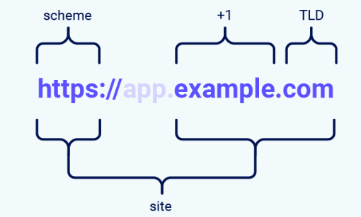
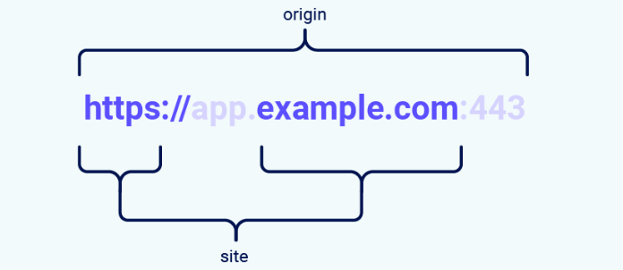

# Cross-site request forgery (CSRF)

## CSRF là gì?
CSRF là một lỗ hổng bảo mật web cho phép kẻ tấn công dụ dỗ người dùng thực hiện các hành động mà họ không có ý định thực hiện. Nó cho phép kẻ tấn công lách luật một phần chính sách cùng nguồn gốc, được thiết kế để ngăn các trang web khác nhau can thiệp lẫn nhau.

Trong một cuộc tấn công CSRF thành công, kẻ tấn công khiến người dùng nạn nhân thực hiện một hành động ngoài ý muốn. Ví dụ: thay đổi địa chỉ email trên tài khoản, đổi mật khẩu hoặc chuyển tiền. Tùy thuộc vào bản chất của hành động, kẻ tấn công có thể chiếm toàn quyền kiểm soát tài khoản của người dùng. Nếu người dùng bị xâm phạm có vai trò đặc quyền trong ứng dụng, kẻ tấn công có thể chiếm toàn quyền kiểm soát tất cả dữ liệu và chức năng của ứng dụng.

## CSRF hoạt động như thế nào?
Để một cuộc tấn công CSRF có thể xảy ra, cần có ba điều kiện then chốt:

- **Một hành động phù hợp.** Trong ứng dụng tồn tại một hành động mà kẻ tấn công có lý do để dụ nạn nhân thực hiện. Đây có thể là hành động đặc quyền (chẳng hạn như sửa quyền của người dùng khác) hoặc bất kỳ hành động nào trên dữ liệu riêng của người dùng (chẳng hạn thay đổi mật khẩu của chính người đó).

- **Xử lý phiên dựa trên cookie.** Việc thực hiện hành động bao gồm việc gửi một hoặc nhiều yêu cầu HTTP, và ứng dụng chỉ dựa vào cookie phiên để nhận diện người đã gửi yêu cầu. Không có cơ chế nào khác để theo dõi phiên hoặc xác thực yêu cầu của người dùng.

- **Không có tham số yêu cầu không thể đoán.** Các yêu cầu thực hiện hành động không chứa tham số nào mà kẻ tấn công không thể xác định hoặc đoán được giá trị. Ví dụ, khi buộc người dùng đổi mật khẩu của họ, chức năng sẽ không dễ bị tấn công nếu kẻ tấn công cần biết giá trị mật khẩu hiện tại.

Ví dụ, giả sử một ứng dụng có chức năng cho phép người dùng đổi địa chỉ email trên tài khoản của họ. Khi người dùng thực hiện hành động này, họ gửi một yêu cầu HTTP như sau:
```makefile
POST /email/change HTTP/1.1
Host: vulnerable-website.com
Content-Type: application/x-www-form-urlencoded
Content-Length: 30
Cookie: session=yvthwsztyeQkAPzeQ5gHgTvlyxHfsAfE

email=wiener@normal-user.com
```

Điều này đáp ứng các điều kiện cần cho CSRF:
- Hành động thay đổi địa chỉ email trên tài khoản của một người dùng là điều mà kẻ tấn công quan tâm. Sau hành động này, kẻ tấn công thường có thể kích hoạt đặt lại mật khẩu và chiếm quyền kiểm soát hoàn toàn tài khoản của nạn nhân.

- Ứng dụng sử dụng cookie phiên để nhận diện người dùng đã phát hành yêu cầu. Không có token hoặc cơ chế nào khác để theo dõi phiên của người dùng.

- Kẻ tấn công có thể dễ dàng xác định các giá trị tham số yêu cầu cần thiết để thực hiện hành động.

Với các điều kiện này, kẻ tấn công có thể dựng một trang web chứa HTML sau:
```html
<html>
    <body>
        <form action="https://vulnerable-website.com/email/change" method="POST">
            <input type="hidden" name="email" value="pwned@evil-user.net" />
        </form>
        <script>
            document.forms[0].submit();
        </script>
    </body>
</html>
```

Nếu một người dùng nạn nhân truy cập trang của kẻ tấn công, những điều sau sẽ xảy ra:

- Trang của kẻ tấn công sẽ kích hoạt một yêu cầu HTTP đến trang web dễ bị tấn công.

- Nếu người dùng đang đăng nhập vào trang web dễ bị tấn công, trình duyệt của họ sẽ tự động đính kèm cookie phiên của họ trong yêu cầu (giả sử cookie SameSite không được sử dụng).

- Trang web dễ bị tấn công sẽ xử lý yêu cầu theo cách bình thường, coi như yêu cầu do người dùng nạn nhân thực hiện, và thay đổi địa chỉ email của họ.

## Cách xây dựng một cuộc tấn công CSRF
Việc tự viết thủ công HTML cho một khai thác CSRF có thể rườm rà, đặc biệt khi yêu cầu mong muốn chứa nhiều tham số hoặc có những “đặc điểm kỳ quặc” khác trong request. Cách dễ nhất để dựng một khai thác CSRF là dùng CSRF PoC generator tích hợp sẵn trong Burp Suite Professional:

- Chọn một request ở bất cứ đâu trong Burp Suite Professional mà bạn muốn kiểm thử hoặc khai thác.

- Từ menu chuột phải, chọn Engagement tools / Generate CSRF PoC.

- Burp Suite sẽ tạo ra một đoạn HTML sẽ kích hoạt request đã chọn (trừ cookie, vì cookie sẽ được trình duyệt của nạn nhân tự động thêm vào).

- Bạn có thể tinh chỉnh nhiều tùy chọn trong CSRF PoC generator để “fine-tune” các khía cạnh của cuộc tấn công. Trong một số tình huống bất thường, bạn có thể cần làm vậy để xử lý các đặc điểm “khó ở” của request.

- Sao chép HTML đã tạo vào một trang web, mở trang đó trong trình duyệt đang đăng nhập vào website dễ bị tấn công, và kiểm tra xem request dự kiến có được gửi thành công và hành động mong muốn có xảy ra hay không.

## Cách triển khai khai thác CSRF
Cơ chế phân phối cho các cuộc tấn công cross-site request forgery về cơ bản giống với reflected XSS. Thông thường, kẻ tấn công sẽ đặt đoạn HTML độc hại lên một website do họ kiểm soát, rồi dụ nạn nhân truy cập website đó. Điều này có thể được thực hiện bằng cách gửi cho người dùng một liên kết đến website, qua email hoặc tin nhắn mạng xã hội. Hoặc nếu cuộc tấn công được đặt vào một website phổ biến (ví dụ, trong phần bình luận của người dùng), họ có thể chỉ cần chờ người dùng truy cập website.

Lưu ý rằng một số khai thác CSRF đơn giản sử dụng phương thức GET và có thể tự chứa hoàn toàn trong một URL duy nhất trên website dễ bị tấn công. Trong tình huống này, kẻ tấn công có thể không cần sử dụng một trang bên ngoài, và có thể gửi trực tiếp cho nạn nhân một URL độc hại trên chính miền dễ bị tấn công. Trong ví dụ trước, nếu yêu cầu đổi địa chỉ email có thể thực hiện bằng phương thức GET, thì một cuộc tấn công tự chứa sẽ trông như sau:
```html

```

## Sự khác nhau giữa XSS và CSRF là gì?
Cross-site scripting (XSS) cho phép kẻ tấn công thực thi JavaScript tùy ý bên trong trình duyệt của người dùng nạn nhân.

Cross-site request forgery (CSRF) cho phép kẻ tấn công khiến người dùng nạn nhân thực hiện các hành động mà họ không hề có ý định làm.

Hậu quả của lỗ hổng XSS thường nghiêm trọng hơn so với lỗ hổng CSRF:
- CSRF thường chỉ áp dụng cho một tập con các hành động mà người dùng có thể thực hiện. Nhiều ứng dụng triển khai phòng vệ CSRF nói chung nhưng bỏ sót một hoặc hai hành động vẫn còn phơi nhiễm. Ngược lại, một khai thác XSS thành công thường có thể buộc người dùng thực hiện bất kỳ hành động nào mà người dùng đó có thể làm, bất kể lỗ hổng nảy sinh ở chức năng nào.

- CSRF có thể được mô tả là một lỗ hổng “một chiều”, theo đó kẻ tấn công có thể khiến nạn nhân phát ra một yêu cầu HTTP, nhưng không thể lấy được phản hồi của yêu cầu đó. Trái lại, XSS là “hai chiều”, vì đoạn script được chèn có thể phát hành các yêu cầu tùy ý, đọc phản hồi, và trích xuất dữ liệu ra một miền bên ngoài do kẻ tấn công chọn.

### CSRF token có ngăn được các cuộc tấn công XSS không?
Một số cuộc tấn công XSS thực sự có thể được ngăn chặn thông qua việc sử dụng CSRF token một cách hiệu quả. Hãy xem xét một lỗ hổng reflected XSS đơn giản có thể bị khai thác dễ dàng như sau:
```php-template
https://insecure-website.com/status?message=<script>/*+Bad+stuff+here...+*/</script>
```

Bây giờ, giả sử chức năng dễ bị tấn công kia có kèm một CSRF token:
```php-template
https://insecure-website.com/status?csrf-token=CIwNZNlR4XbisJF39I8yWnWX9wX4WFoz&message=<script>/*+Bad+stuff+here...+*/</script>
```

Giả định máy chủ kiểm tra hợp lệ CSRF token một cách đúng đắn, và từ chối các yêu cầu không có token hợp lệ, thì token này có ngăn chặn việc khai thác lỗ hổng XSS. Manh mối nằm ngay ở tên gọi: “cross-site scripting”, ít nhất ở dạng reflected, bao gồm một yêu cầu cross-site. Bằng cách ngăn kẻ tấn công giả mạo một yêu cầu cross-site, ứng dụng đã ngăn việc khai thác lỗ hổng XSS theo cách tầm thường.

Tuy nhiên, có một số lưu ý quan trọng:
- Nếu tồn tại một lỗ hổng reflected XSS ở bất kỳ nơi nào khác trên trang web trong một chức năng không được bảo vệ bởi CSRF token, thì lỗ hổng XSS đó vẫn có thể bị khai thác theo cách thông thường.

- Nếu tồn tại bất kỳ lỗ hổng XSS có thể khai thác nào trên trang web, thì lỗ hổng đó có thể được tận dụng để buộc người dùng nạn nhân thực hiện các hành động cho dù các hành động này bản thân chúng được bảo vệ bởi CSRF token. Trong tình huống này, script của kẻ tấn công có thể yêu cầu trang liên quan để lấy một CSRF token hợp lệ, rồi sử dụng token đó để thực hiện hành động được bảo vệ.

- CSRF token không bảo vệ khỏi các lỗ hổng stored XSS. Nếu một trang được bảo vệ bởi CSRF token đồng thời cũng là điểm xuất của một lỗ hổng stored XSS, thì lỗ hổng XSS đó vẫn có thể bị khai thác theo cách thông thường, và payload XSS sẽ được thực thi khi người dùng truy cập trang.

## Các biện pháp phòng thủ chung chống lại CSRF

Ngày nay, để tìm và khai thác thành công lỗ hổng CSRF thường phải vượt qua các biện pháp chống CSRF do chính trang web mục tiêu, trình duyệt của nạn nhân, hoặc cả hai triển khai. Những biện pháp phòng vệ phổ biến bạn sẽ gặp gồm:

- CSRF token – CSRF token là một giá trị duy nhất, bí mật và không thể đoán, được ứng dụng phía máy chủ tạo ra và chia sẻ với phía khách. Khi cố gắng thực hiện một hành động nhạy cảm, như gửi form, phía khách phải đưa đúng CSRF token vào yêu cầu. Điều này khiến kẻ tấn công rất khó dựng một yêu cầu hợp lệ thay mặt nạn nhân.

- Cookie SameSite – SameSite là một cơ chế bảo mật của trình duyệt quyết định khi nào cookie của một website sẽ được đính kèm vào các yêu cầu bắt nguồn từ website khác. Vì các yêu cầu thực hiện hành động nhạy cảm thường cần cookie phiên đã xác thực, việc áp dụng hạn chế SameSite phù hợp có thể ngăn kẻ tấn công kích hoạt các hành động này theo kiểu cross-site. Từ năm 2021, Chrome mặc định áp dụng hạn chế SameSite ở mức Lax. Vì đây là tiêu chuẩn được đề xuất, chúng tôi kỳ vọng các trình duyệt lớn khác cũng sẽ áp dụng hành vi này trong tương lai.

- Xác thực dựa trên Referer – Một số ứng dụng sử dụng header HTTP Referer để cố gắng phòng chống CSRF, thường bằng cách kiểm tra rằng yêu cầu bắt nguồn từ cùng tên miền của ứng dụng. Cách này nhìn chung kém hiệu quả hơn so với việc xác thực bằng CSRF token.

## Bypassing CSRF token validation
### CSRF token là gì?
CSRF token là một giá trị duy nhất, bí mật và khó đoán, được ứng dụng phía máy chủ tạo ra và chia sẻ với phía khách. Khi gửi một yêu cầu để thực hiện hành động nhạy cảm, chẳng hạn như gửi một biểu mẫu (form), phía khách bắt buộc phải kèm CSRF token chính xác. Nếu không, máy chủ sẽ từ chối thực hiện hành động được yêu cầu.

Một cách phổ biến để chia sẻ CSRF token với phía khách là nhúng nó như một tham số ẩn trong HTML form, ví dụ:
```html
<form name="change-email-form" action="/my-account/change-email" method="POST">
    <label>Email</label>
    <input required type="email" name="email" value="example@normal-website.com">
    <input required type="hidden" name="csrf" value="50FaWgdOhi9M9wyna8taR1k3ODOR8d6u">
    <button class='button' type='submit'> Update email </button>
</form>
```
Gửi biểu mẫu này sẽ tạo ra yêu cầu sau:
```makefile
POST /my-account/change-email HTTP/1.1
Host: normal-website.com
Content-Length: 70
Content-Type: application/x-www-form-urlencoded

csrf=50FaWgdOhi9M9wyna8taR1k3ODOR8d6u&email=example@normal-website.com
```

Khi được triển khai đúng cách, CSRF token giúp bảo vệ chống lại các cuộc tấn công CSRF bằng cách khiến kẻ tấn công khó dựng một yêu cầu hợp lệ thay mặt nạn nhân. Do kẻ tấn công không có cách nào để dự đoán đúng giá trị của CSRF token, họ sẽ không thể đưa nó vào yêu cầu độc hại.
### Những lỗi thường gặp trong xác thực CSRF token
---
#### Việc xác thực CSRF token phụ thuộc vào phương thức yêu cầu
- Một số ứng dụng xác thực token đúng khi yêu cầu dùng phương thức POST nhưng lại bỏ qua việc xác thực khi dùng GET.

- Trong tình huống này, kẻ tấn công có thể chuyển sang phương thức GET để bỏ qua việc xác thực và thực hiện tấn công CSRF:
    ```vbnet
    GET /email/change?email=pwned@evil-user.net HTTP/1.1
    Host: vulnerable-website.com
    Cookie: session=2yQIDcpia41WrATfjPqvm9tOkDvkMvLm
    ```

#### Việc xác thực CSRF token phụ thuộc vào việc token có hay không

- Một số ứng dụng xác thực token đúng khi token có mặt, nhưng lại bỏ qua xác thực nếu token bị thiếu.

- Trong tình huống này, kẻ tấn công có thể xóa toàn bộ tham số chứa token (không chỉ giá trị của nó) để vượt qua xác thực và thực hiện tấn công CSRF:

```makefile
POST /email/change HTTP/1.1
Host: vulnerable-website.com
Content-Type: application/x-www-form-urlencoded
Content-Length: 25
Cookie: session=2yQIDcpia41WrATfjPqvm9tOkDvkMvLm

email=pwned@evil-user.net
```

#### CSRF token không được ràng buộc với session người dùng
Một số ứng dụng không kiểm tra rằng token thực sự thuộc cùng phiên (session) với người đang gửi yêu cầu. Thay vào đó, ứng dụng duy trì một pool token toàn cục đã cấp và chấp nhận bất kỳ token nào xuất hiện trong pool này.

Trong tình huống đó, kẻ tấn công có thể đăng nhập vào ứng dụng bằng tài khoản của chính họ, lấy một token hợp lệ, rồi đưa token đó vào payload tấn công CSRF để tấn công nạn nhân.

#### CSRF token được ràng buộc với cookie không phải cookie phiên
Trong một biến thể của lỗ hổng trước đó, một vài ứng dụng ràng buộc CSRF token với một cookie, nhưng cookie đó không phải cookie dùng để theo dõi phiên đăng nhập. Tình trạng này dễ xảy ra khi ứng dụng dùng hai framework khác nhau — một framework quản lý session, một framework cung cấp bảo vệ CSRF — nhưng không tích hợp chúng với nhau. Ví dụ request:
```makefile
POST /email/change HTTP/1.1
Host: vulnerable-website.com
Content-Type: application/x-www-form-urlencoded
Content-Length: 68
Cookie: session=pSJYSScWKpmC60LpFOAHKixuFuM4uXWF; csrfKey=rZHCnSzEp8dbI6atzagGoSYyqJqTz5dv

csrf=RhV7yQDO0xcq9gLEah2WVbmuFqyOq7tY&email=wiener@normal-user.com
```

#### CSRF token bị nhân đôi đơn giản trong cookie

Một biến thể khác của lỗ hổng trước đó là một số ứng dụng không lưu bất kỳ bản ghi phía máy chủ nào về các token đã cấp, mà thay vào đó nhân đôi mỗi token vào cả cookie và tham số yêu cầu. Khi yêu cầu tiếp theo được xác thực, ứng dụng chỉ đơn thuần kiểm tra rằng token gửi trong tham số khớp với giá trị trong cookie. Cách này đôi khi được gọi là biện pháp “double submit” chống CSRF, và được khuyến nghị vì đơn giản để triển khai và không cần trạng thái phía máy chủ. Ví dụ request:
```makefile
POST /email/change HTTP/1.1
Host: vulnerable-website.com
Content-Type: application/x-www-form-urlencoded
Content-Length: 68
Cookie: session=1DQGdzYbOJQzLP7460tfyiv3do7MjyPw; csrf=R8ov2YBfTYmzFyjit8o2hKBuoIjXXVpa

csrf=R8ov2YBfTYmzFyjit8o2hKBuoIjXXVpa&email=wiener@normal-user.com
```
Trong tình huống này, kẻ tấn công vẫn có thể thực hiện tấn công CSRF nếu website có bất kỳ chức năng nào cho phép thiết lập cookie trong trình duyệt nạn nhân. Ở đây, kẻ tấn công không cần lấy một token hợp lệ của riêng họ. Họ chỉ cần tạo một token giả (có thể theo định dạng mong muốn nếu ứng dụng kiểm tra), lợi dụng chức năng đặt cookie để chèn cookie đó vào trình duyệt nạn nhân, rồi cung cấp token này trong yêu cầu CSRF gửi thay mặt nạn nhân — và vì cookie + tham số khớp nên server chấp nhận.

## Bypass hạn chế cookie SameSite
SameSite là một cơ chế bảo mật của trình duyệt, quyết định khi nào cookie của một website được kèm vào các yêu cầu xuất phát từ các website khác. Hạn chế SameSite cung cấp bảo vệ một phần chống nhiều kiểu tấn công xuyên trang (cross-site), bao gồm CSRF, cross-site leaks và một số khai thác liên quan đến CORS.

Kể từ năm 2021, Chrome áp dụng mặc định hạn chế SameSite ở mức Lax nếu website cấp cookie không tự thiết lập mức hạn chế riêng. Đây là tiêu chuẩn được đề xuất, và chúng ta kỳ vọng các trình duyệt lớn khác sẽ áp dụng hành vi tương tự trong tương lai. Do đó, điều quan trọng là phải nắm vững cách hoạt động của SameSite, cũng như các cách có thể dùng để bypass (vượt qua) các hạn chế này, nếu muốn kiểm thử toàn diện các vector tấn công cross-site.

### “Site” nghĩa là gì trong ngữ cảnh cookie SameSite?
Trong ngữ cảnh hạn chế cookie SameSite, site được định nghĩa là tên miền cấp cao nhất (TLD) cộng thêm một cấp tên miền nữa. Thường gọi là TLD+1 (ví dụ: `example.com` là TLD+1 cho các host con như `app.example.com`).

Khi xác định một yêu cầu có phải là same-site hay không, trình duyệt còn xét cả scheme của URL (http hoặc https). Điều này có nghĩa là một liên kết từ `http://app.example.com` đến `https://app.example.com` được coi là cross-site bởi hầu hết trình duyệt.



### Sự khác biệt giữa “site” và “origin”
Điểm khác nhau giữa site và origin nằm ở phạm vi của chúng:

- Site bao gồm nhiều tên miền con (subdomains).
- Origin chỉ bao gồm một miền cụ thể duy nhất.

Dù hai khái niệm này liên quan chặt chẽ, nhưng không nên dùng thay thế cho nhau, vì nhầm lẫn giữa chúng có thể dẫn đến lỗ hổng bảo mật nghiêm trọng.

Hai URL được xem là cùng origin nếu chúng có chính xác cùng:
- Scheme (giao thức) – ví dụ: http hoặc https
- Domain name (tên miền)
- Port (cổng)



Như ví dụ cho thấy, thuật ngữ “site” ít cụ thể hơn vì nó chỉ xét scheme và phần cuối của tên miền. Điều then chốt là: một yêu cầu có thể là cross-origin nhưng vẫn same-site, còn ngược lại thì không.

| Yêu cầu từ                          | Yêu cầu đến                          | Same-site?                    | Same-origin?                   |
|-------------------------------------|--------------------------------------|-------------------------------:|--------------------------------|
| `https://example.com`                 | `https://example.com`                  | Yes                            | Yes                            |
| `https://app.example.com`             | `https://intranet.example.com`         | Yes                            | No: khác tên miền              |
| `https://example.com`                 | `https://example.com:8080`             | Yes                            | No: khác port                  |
| `https://example.com`                 | `https://example.co.uk`                | No: khác eTLD                  | No: khác tên miền              |
| `https://example.com`                 | `http://example.com`                   | No: khác scheme                | No: khác scheme                |


Đây là điểm phân biệt quan trọng vì nó có nghĩa rằng bất kỳ lỗ hổng nào cho phép thực thi JavaScript tùy ý đều có thể bị lạm dụng để vượt qua các biện pháp bảo vệ dựa trên site trên các domain khác thuộc cùng một site. Chúng ta sẽ thấy một ví dụ minh họa trong một lab ở phần sau.

### SameSite hoạt động như thế nào?

Trước khi cơ chế SameSite được giới thiệu, trình duyệt gửi cookie trong mọi yêu cầu tới domain đã cấp cookie, ngay cả khi yêu cầu đó được kích hoạt bởi một trang web bên thứ ba không liên quan. SameSite cho phép trình duyệt và chủ website giới hạn những yêu cầu cross-site nào (nếu có) sẽ kèm cookie tương ứng. Điều này giúp giảm rủi ro cho người dùng trước các cuộc tấn công CSRF — những tấn công khiến trình duyệt nạn nhân thực hiện một yêu cầu gây hại tới trang web dễ bị tấn công. Vì các yêu cầu này thường cần cookie phiên đã xác thực của nạn nhân, nên tấn công sẽ thất bại nếu trình duyệt không gửi cookie đó.

Tất cả các trình duyệt lớn hiện hỗ trợ các mức hạn chế SameSite sau:
- Strict
- Lax
- None

Nhà phát triển có thể cấu hình thủ công mức hạn chế cho từng cookie họ đặt, để kiểm soát khi nào cookie đó được sử dụng. Để làm vậy, họ chỉ cần thêm thuộc tính SameSite vào header Set-Cookie trong phản hồi, cùng với giá trị mong muốn. Ví dụ:
```pgsql
Set-Cookie: session=0F8tgdOhi9ynR1M9wa3ODa; SameSite=Strict
```

Mặc dù điều này cung cấp một phần bảo vệ chống CSRF, không có mức hạn chế nào đảm bảo miễn dịch tuyệt đối — điều này sẽ được minh hoạ qua các lab tương tác cố ý dễ bị tấn công trong phần sau.

#### SameSite = Strict
Nếu một cookie được đặt với thuộc tính `SameSite=Strict`, trình duyệt sẽ không gửi cookie đó trong bất kỳ yêu cầu cross-site nào.
Nói đơn giản: nếu trang đích của yêu cầu không trùng với site đang hiển thị trong thanh địa chỉ trình duyệt, thì cookie sẽ không được gửi kèm.

Mức này được khuyến nghị sử dụng cho các cookie chứa quyền truy cập nhạy cảm, ví dụ:

- Cookie cho phép người dùng thực hiện thay đổi dữ liệu
- Cookie để truy cập các trang yêu cầu đăng nhập

Dù đây là lựa chọn an toàn nhất, nhưng nó có thể làm giảm trải nghiệm người dùng trong những trường hợp cần tương tác giữa các site (cross-site functionality).

#### SameSite = Lax
Với mức hạn chế Lax, trình duyệt vẫn gửi cookie trong một số yêu cầu cross-site, nhưng chỉ khi đồng thời thỏa mãn hai điều kiện sau:

- Yêu cầu sử dụng phương thức GET.
- Yêu cầu được sinh ra bởi hành động điều hướng cấp cao nhất của người dùng, ví dụ: người dùng bấm vào một liên kết.

Điều đó có nghĩa là cookie sẽ không được gửi trong các yêu cầu POST cross-site.
Mà các yêu cầu POST thường dùng để thay đổi dữ liệu hoặc trạng thái, nên đây chính là loại yêu cầu mà các cuộc tấn công CSRF thường nhắm tới.

Tương tự, cookie cũng không được gửi trong các yêu cầu nền (background requests), như các yêu cầu được khởi tạo bởi:

- script (JavaScript),
- iframe,
- hoặc các tài nguyên như hình ảnh, CSS, AJAX,...

#### SameSite = None
Nếu cookie được đặt với thuộc tính `SameSite=None`, điều này có nghĩa là vô hiệu hóa hoàn toàn cơ chế SameSite.
Khi đó, trình duyệt sẽ gửi cookie trong mọi yêu cầu đến domain đã cấp nó, kể cả những yêu cầu được khởi tạo từ trang web hoàn toàn không liên quan.

Ngoại trừ Chrome, đây là hành vi mặc định của hầu hết các trình duyệt cũ nếu cookie không được gán thuộc tính SameSite.

Có những lý do hợp lệ để tắt SameSite, chẳng hạn:
- Khi cookie được dùng trong ngữ cảnh bên thứ ba (third-party),
- Và cookie đó không cấp quyền truy cập dữ liệu hoặc chức năng nhạy cảm.
→ Ví dụ điển hình: tracking cookies (cookie theo dõi hành vi người dùng).

Tuy nhiên, nếu bạn gặp cookie có `SameSite=None` hoặc không có giới hạn rõ ràng, cần xem xét kỹ xem cookie đó có thực sự cần thiết không.
Khi Chrome áp dụng cơ chế “Lax-by-default”, nhiều chức năng web cũ bị lỗi; vì vậy, một số website đã tạm thời tắt SameSite cho tất cả cookie, kể cả những cookie nhạy cảm, điều này tiềm ẩn rủi ro bảo mật.

Khi đặt cookie với `SameSite=None`, website bắt buộc phải thêm thuộc tính `Secure`, đảm bảo cookie chỉ được gửi qua kết nối HTTPS được mã hóa.
Nếu không, trình duyệt sẽ từ chối cookie và nó sẽ không được lưu.

```python
Set-Cookie: trackingId=0F8tgdOhi9ynR1M9wa3ODa; SameSite=None; Secure
```

**Tóm lại:**

| Mức SameSite | Trình duyệt gửi cookie khi nào                 | Mức bảo mật | Ghi chú                                  |
|---------------|-----------------------------------------------|--------------|------------------------------------------|
| **Strict**    | Chỉ gửi nếu cùng site                         |  Cao nhất  | An toàn nhưng có thể giảm UX             |
| **Lax**       | Gửi khi người dùng bấm link (GET, top-level)  |  Trung bình | Mặc định trong Chrome từ 2021           |
| **None**      | Gửi trong mọi request cross-site              |  Thấp      | Phải có `Secure`; dùng cho cookie bên thứ ba |

### Bypass hạn chế `SameSite=Lax` bằng các yêu cầu GET
Trong thực tế, máy chủ không phải lúc nào cũng phân biệt kỹ giữa GET hay POST với cùng một endpoint — ngay cả những endpoint vốn kỳ vọng một biểu mẫu (form) gửi lên. Nếu máy chủ đó còn áp dụng hạn chế SameSite ở mức Lax cho cookie phiên (do cấu hình hoặc do mặc định trình duyệt), bạn vẫn có thể thực hiện tấn công CSRF bằng cách khiến trình duyệt nạn nhân phát sinh một yêu cầu GET.

Chỉ cần yêu cầu đó là một điều hướng ở cấp cao nhất (top-level navigation), trình duyệt sẽ vẫn kèm cookie phiên của nạn nhân. Cách đơn giản nhất để tấn công như vậy là:
```html
<script>
    document.location = 'https://vulnerable-website.com/account/transfer-payment?recipient=hacker&amount=1000000';
</script>
```

Ngay cả khi một yêu cầu GET “thường” không được phép để thực hiện hành động thay đổi trạng thái, một số framework vẫn cho phép ghi đè phương thức được chỉ định trong dòng yêu cầu. Ví dụ, Symfony hỗ trợ tham số `_method` trong form, và giá trị này được ưu tiên dùng cho routing:

```html
<form action="https://vulnerable-website.com/account/transfer-payment" method="POST">
    <input type="hidden" name="_method" value="GET">
    <input type="hidden" name="recipient" value="hacker">
    <input type="hidden" name="amount" value="1000000">
</form>
```

Nhiều framework khác cũng hỗ trợ các tham số tương tự để đổi phương thức — đây là một trong những lý do vì sao vẫn cần phòng thủ đúng (kiểm tra CSRF token cho mọi hành động thay đổi trạng thái, kiểm tra Origin/Referer, không cho phép hành động nhạy cảm qua GET, v.v.).

### Bypass hạn chế SameSite bằng cách lợi dụng gadget trong cùng site

Nếu một cookie được đặt với thuộc tính `SameSite=Strict`, các trình duyệt sẽ không gửi cookie đó trong bất kỳ yêu cầu nào phát sinh từ các trang bên thứ ba (cross-site). Tuy nhiên, bạn có thể vượt qua giới hạn này nếu tìm được một gadget trên chính trang (một tính năng/điểm có thể điều khiển được) mà dẫn tới một yêu cầu thứ cấp bên trong cùng site.

Một gadget khả thi là chuyển hướng phía client (client-side redirect) mà mục tiêu chuyển hướng được xây dựng động từ tham số đầu vào do kẻ tấn công kiểm soát (ví dụ: tham số URL). 

Về mặt trình duyệt, các chuyển hướng này không được coi là redirect thực sự; yêu cầu sinh ra sau đó chỉ được xử lý như một yêu cầu độc lập thông thường. Quan trọng nhất là yêu cầu này là same-site, nên sẽ kèm theo tất cả cookie liên quan đến site đó, bất kể những hạn chế SameSite đã được thiết lập hay chưa.

Nếu bạn có thể thao tác gadget sao cho nó phát sinh một yêu cầu thứ cấp độc hại, thì bạn có thể vượt hoàn toàn các hạn chế SameSite.

### Bypass hạn chế SameSite qua các domain “anh em” (sibling domains)
Dù bạn đang kiểm thử website của người khác hay muốn bảo vệ website của mình, hãy nhớ rằng một yêu cầu vẫn có thể được xem là same-site ngay cả khi nó là cross-origin.

Hãy kiểm tra kỹ mọi bề mặt tấn công có thể truy cập được, bao gồm các domain anh em. Đặc biệt, những lỗ hổng cho phép bạn sinh ra một yêu cầu thứ cấp tùy ý, như XSS, có thể làm vô hiệu hoàn toàn các biện pháp bảo vệ dựa trên site, khiến tất cả domain thuộc cùng một site bị lộ ra trước các tấn công cross-site.

Bên cạnh CSRF cổ điển, đừng quên rằng nếu website mục tiêu hỗ trợ WebSocket, chức năng này có thể bị tổn thương bởi cross-site WebSocket hijacking (CSWSH) — về cơ bản là một cuộc tấn công tương tự CSRF nhắm vào bước bắt tay (handshake) của WebSocket. Để biết chi tiết hơn, xem phần tài liệu về các lỗ hổng WebSocket.

### Bypass hạn chế SameSite=Lax bằng cookie mới được cấp

Cookie có hạn chế SameSite=Lax thường không được gửi trong các yêu cầu POST cross-site, nhưng có một vài ngoại lệ.

Như đã đề cập trước đó, nếu một website không ghi rõ thuộc tính SameSite khi đặt cookie, Chrome sẽ tự động áp dụng hạn chế Lax theo mặc định. Tuy nhiên, để tránh làm hỏng các cơ chế đăng nhập một lần (SSO), Chrome không thực thi ngay lập tức hạn chế này đối với các POST top-level trong 120 giây đầu tiên kể từ khi cookie được cấp. Kết quả là có một cửa sổ hai phút trong đó người dùng có thể bị lộ trước các cuộc tấn công cross-site.

Thực tế là khá khó để canh thời gian tấn công rơi đúng vào cửa sổ ngắn này. Tuy nhiên, nếu bạn tìm được một gadget trên trang cho phép bạn khiến nạn nhân được cấp cookie phiên mới, bạn có thể chủ động làm mới cookie của họ trước khi tiến hành tấn công chính. Ví dụ, hoàn thành một luồng đăng nhập dựa trên OAuth có thể tạo ra một session mới mỗi lần — vì dịch vụ OAuth không nhất thiết biết người dùng vẫn đang đăng nhập trên site mục tiêu hay không.

Để kích hoạt việc làm mới cookie mà không cần nạn nhân phải đăng nhập thủ công lại, bạn cần dùng top-level navigation, điều này đảm bảo các cookie liên quan tới session OAuth hiện tại được đính kèm. Điều này tạo ra thách thức bổ sung vì bạn phải chuyển hướng người dùng trở lại trang của mình để rồi phát động cuộc tấn công CSRF.

Một phương án khác là làm mới cookie trong một tab mới để trình duyệt không rời khỏi trang hiện tại của nạn nhân trước khi bạn gửi tấn công cuối cùng. Một vấn đề nhỏ là trình duyệt chặn các tab bật lên (popup) nếu chúng không được mở thông qua tương tác thủ công của người dùng. Ví dụ, lệnh sau đây sẽ bị chặn mặc định:

```js
window.open('https://vulnerable-website.com/login/sso');
```

Để vượt qua, bạn có thể bọc lời gọi trong một trình xử lý onclick, chẳng hạn:
```js
window.onclick = () => {
    window.open('https://vulnerable-website.com/login/sso');
}
```

Khi đó `window.open()` chỉ được gọi khi người dùng nhấp vào trang, nên trình duyệt sẽ cho phép mở tab/pop-up — từ đó bạn có thể thực hiện luồng làm mới cookie rồi tiếp tục tấn công.

## Bpass cơ chế phòng CSRF dựa trên Referer
### Header Referer
Header HTTP Referer (từ viết sai chính tả trong đặc tả HTTP) là một header tùy chọn chứa URL của trang web đã liên kết tới tài nguyên đang được yêu cầu. Trình duyệt thường tự động thêm header này khi người dùng khởi tạo một yêu cầu HTTP, bao gồm việc bấm vào liên kết hoặc gửi form. Có nhiều phương thức cho phép trang liên kết giấu hoặc sửa giá trị Referer — thường làm vì lý do riêng tư.

### Việc kiểm tra Referer phụ thuộc vào header có hay không
Một số ứng dụng chỉ kiểm tra header Referer khi nó xuất hiện trong yêu cầu, nhưng bỏ qua việc kiểm tra nếu header bị thiếu.

Trong trường hợp này, kẻ tấn công có thể tạo PoC CSRF sao cho trình duyệt nạn nhân bỏ qua (không gửi) header Referer khi phát sinh yêu cầu. Có nhiều cách làm điều này, nhưng cách đơn giản nhất là dùng thẻ `<meta>` trong trang HTML chứa mã tấn công CSRF:
```html
<meta name="referrer" content="never">
```
Khi thẻ này tồn tại trên trang, trình duyệt sẽ không gửi header Referer cho các yêu cầu phát sinh từ trang đó, và do ứng dụng chỉ kiểm tra khi header hiện diện, kiểm tra Referer sẽ bị né — từ đó bypass được cơ chế bảo vệ dựa trên Referer.

## Validation of Referer can be bypass

Một số ứng dụng xác thực header Referer theo cách sơ khai và có thể bị bỏ qua. Ví dụ, nếu ứng dụng kiểm tra rằng domain trong Referer phải bắt đầu bằng giá trị mong đợi, thì kẻ tấn công có thể đặt giá trị đó làm subdomain của domain tấn công:
```arduino
http://vulnerable-website.com.attacker-website.com/csrf-attack
```
Tương tự, nếu ứng dụng chỉ kiểm tra Referer có chứa tên domain của nó hay không, thì kẻ tấn công có thể đặt chuỗi domain cần thiết ở chỗ khác trong URL:
```arduino
http://attacker-website.com/csrf-attack?vulnerable-website.com
```
Cả hai trường hợp đều lợi dụng việc kiểm tra chuỗi đơn giản (substring/startsWith) và cho thấy vì sao phải so sánh origin/host chính xác thay vì chỉ kiểm tra sự tồn tại hay tiền tố của chuỗi domain trong Referer.

## Cách phòng tránh lỗ hổng CSRF
### Sử dụng CSRF Token
Cách phòng thủ mạnh mẽ nhất chống lại tấn công CSRF là chèn CSRF token vào các request liên quan. Token phải thỏa mãn các điều kiện sau:
- Không thể đoán được (có độ ngẫu nhiên cao, entropy lớn — giống như session token).
- Gắn liền với phiên người dùng (session).
- Được kiểm tra nghiêm ngặt trong mọi trường hợp trước khi hành động được thực hiện.

#### Cách tạo CSRF token
CSRF token cần có entropy cao và không thể dự đoán, giống như session token.
- Nên được tạo ra bằng bộ sinh số ngẫu nhiên mật mã (CSPRNG), được khởi tạo (seed) bằng thời gian tạo token + một secret tĩnh.
- Để tăng độ bảo mật, có thể nối thêm thông tin đặc trưng người dùng (ví dụ: userID) rồi băm lại bằng hàm băm mạnh (SHA-256, SHA-512,…).
→ Điều này giúp ngăn kẻ tấn công phân tích mẫu của các token mà họ thu thập được.
#### Cách truyền CSRF token
CSRF token phải được xem như một bí mật và xử lý cẩn trọng trong suốt vòng đời của nó.

Chèn token trong thẻ input ẩn của form HTML dùng phương thức POST:
```html
<input type="hidden" name="csrf-token" value="CIwNZNlR4XbisJF39I8yWnWX9wX4WFoz" />
```
- Nên đặt thẻ input chứa token ở đầu form, trước các input do người dùng điều khiển, để giảm rủi ro bị chèn mã độc hoặc rò rỉ dữ liệu.

Không nên:
- Truyền token trong URL query string vì:
    - URL có thể bị ghi log ở nhiều nơi (client, server).
    - Dễ bị rò rỉ qua header Referer khi chuyển trang.
    - Có thể hiển thị công khai trên trình duyệt người dùng.
- Lưu token trong cookie, vì dễ bị gửi kèm tự động.

**Cách khác (ít phổ biến hơn):** Gửi token trong custom HTTP header (ví dụ X-CSRF-Token) khi dùng AJAX/XHR.
- Ưu điểm: Trình duyệt không gửi header này cross-domain.
- Nhược điểm: Không dùng được cho các form HTML thông thường.

#### Cách kiểm tra CSRF token

Khi tạo token:
- Lưu token đó ở server, trong session của người dùng.

Khi nhận request:
- So sánh token trong request với token lưu trong session.
- Từ chối mọi request:
    - Không có token.
    - Token sai hoặc không khớp.

Việc kiểm tra phải được thực hiện với mọi loại request — bất kể HTTP method hay content type.


### Sử dụng SameSite Cookie
Bên cạnh CSRF token, bạn nên thiết lập SameSite cookie rõ ràng cho tất cả cookie bạn gửi:

- SameSite=Strict → an toàn nhất, chỉ gửi cookie khi người dùng truy cập trực tiếp vào site.

- SameSite=Lax → cho phép gửi cookie khi người dùng click link dẫn đến site (an toàn vừa phải).

- SameSite=None → KHÔNG nên dùng, trừ khi bạn hiểu rõ rủi ro và cần hỗ trợ cross-site thực sự (phải kèm Secure).

Mặc dù một số trình duyệt mặc định Lax, nhưng không nên phụ thuộc vào mặc định vì mỗi trình duyệt xử lý khác nhau.


### Cẩn trọng với Cross-Origin Same-Site Attacks

SameSite chỉ ngăn cross-site chứ không ngăn cross-origin trong cùng site (ví dụ các subdomain).

→ Nếu có nội dung không an toàn (như file người dùng tải lên), hãy:
- Tách chúng sang miền khác (ví dụ static.example.com)
- Giữ dữ liệu nhạy cảm ở miền chính (secure.example.com).

Khi kiểm thử, cần kiểm tra toàn bộ các subdomain và thành phần trong cùng một site để đảm bảo không bị khai thác CSRF nội bộ.