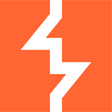
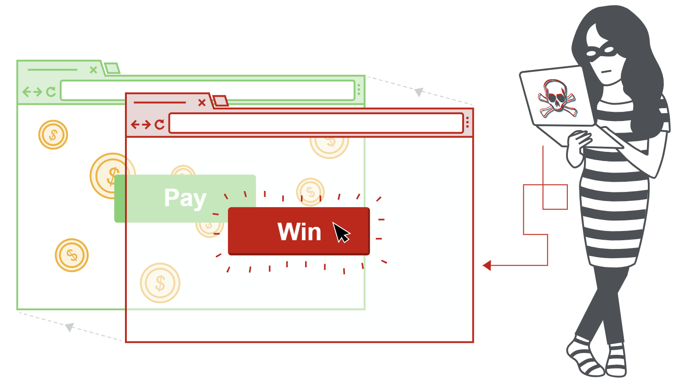

# Clickjacking 



## Clickjacking là gì?

Clickjacking là một kiểu tấn công dựa trên giao diện, trong đó người dùng bị lừa bấm vào một thành phần có thể tương tác trên một website bị ẩn, trong khi họ tưởng rằng mình đang bấm vào nội dung khác trên một website giả mạo.

Hãy xem ví dụ sau:

Một người dùng truy cập vào một website giả (có thể từ một liên kết trong email).
Họ nhìn thấy một nút kiểu như “Bấm để nhận quà” và nhấn vào.
Nhưng thực ra, kẻ tấn công đã lừa họ bấm vào một nút khác bị ẩn, và hành động đó có thể dẫn đến việc thanh toán tiền cho một tài khoản trên website khác.



Đây chính là một ví dụ của clickjacking.

Kỹ thuật này dựa vào việc chèn một trang web vô hình nhưng vẫn có thể bấm được vào bên trong một iframe. iframe này được đặt chồng lên nội dung của trang giả mà người dùng đang nhìn thấy.

## Clickjacking khác gì CSRF?

Clickjacking khác với CSRF ở chỗ:

- Với clickjacking, người dùng phải thật sự thực hiện hành động, ví dụ như bấm nút.
- Với CSRF, kẻ tấn công giả mạo toàn bộ request mà người dùng không hề biết hay thao tác gì.

Thông thường, CSRF được giảm thiểu bằng CSRF token — một giá trị duy nhất, gắn với phiên làm việc và chỉ dùng một lần. Nhưng clickjacking không bị chặn bởi CSRF token, vì:

- phiên làm việc của nạn nhân là phiên thật
- nội dung được tải từ website thật
- mọi request vẫn diễn ra đúng domain
- điểm khác biệt duy nhất là quá trình này xảy ra trong một iframe bị ẩn

## Cách tạo một cuộc tấn công clickjacking cơ bản

Clickjacking thường dùng CSS để tạo và điều khiển các lớp giao diện.

Kẻ tấn công sẽ:

- nhúng website mục tiêu vào một iframe
- đặt iframe đó chồng lên trang giả

Ví dụ:

```html
<head>
	<style>
		#target_website {
			position:relative;
			width:128px;
			height:128px;
			opacity:0.00001;
			z-index:2;
			}
		#decoy_website {
			position:absolute;
			width:300px;
			height:400px;
			z-index:1;
			}
	</style>
</head>
...
<body>
	<div id="decoy_website">
	...decoy web content here...
	</div>
	<iframe id="target_website" src="https://vulnerable-website.com">
	</iframe>
</body>
```

### Ý nghĩa của đoạn này:
- `target_website` là website thật cần tấn công
- `decoy_website` là website giả mà người dùng nhìn thấy
- `z-index` quyết định lớp nào nằm trên lớp nào
- `opacity` gần bằng 0 làm cho iframe gần như trong suốt, nên người dùng không thấy nó
- `position`, `width`, `height` giúp căn chỉnh chính xác để nút thật nằm ngay dưới chỗ người dùng sắp bấm trên trang giả

Một số trình duyệt có cơ chế phát hiện iframe quá trong suốt để chống clickjacking. Ví dụ Chrome có thể phát hiện theo ngưỡng độ trong suốt, còn Firefox thì không áp dụng giống vậy. Vì thế, attacker thường chọn giá trị opacity vừa đủ để che giấu mà vẫn tránh cơ chế bảo vệ.

### Clickbandit

Dù bạn có thể tự tạo PoC clickjacking bằng HTML/CSS như trên, nhưng việc này khá mất thời gian. Khi kiểm thử ngoài thực tế, PortSwigger khuyên nên dùng công cụ Clickbandit của Burp.

Công cụ này cho phép bạn:

- thao tác trực tiếp bằng trình duyệt trên trang có thể bị frame
- sau đó tự tạo một file HTML chứa lớp clickjacking chồng sẵn

Nhờ vậy, bạn có thể tạo PoC tương tác rất nhanh mà không cần tự viết HTML hay CSS.

## Clickjacking với form đã được điền sẵn

Một số website cho phép điền sẵn dữ liệu vào form bằng tham số GET trước khi submit.

Điều này có nghĩa là:

- attacker có thể sửa URL
- chèn sẵn giá trị mà họ muốn vào form
- sau đó đặt nút `submit` vô hình chồng lên trang giả, giống như trong ví dụ clickjacking cơ bản

Khi đó, nạn nhân chỉ cần bấm một cái là form sẽ được gửi với dữ liệu đã bị attacker chuẩn bị sẵn.

## Script phá frame (Frame busting scripts)

Clickjacking xảy ra khi website có thể bị nhúng trong frame. Vì vậy, các biện pháp phòng chống thường tập trung vào việc ngăn website bị frame.

Một cách bảo vệ phía client là dùng frame busting script hoặc frame breaking script. Các script này thường cố làm một số việc như:

- kiểm tra xem cửa sổ hiện tại có phải cửa sổ chính hay không
- làm cho mọi frame trở nên nhìn thấy được
- ngăn click vào frame vô hình
- phát hiện và cảnh báo clickjacking cho người dùng

Tuy nhiên, cách này có nhiều hạn chế:

- phụ thuộc vào trình duyệt và nền tảng
- thường có thể bị bypass
- nếu JavaScript bị chặn hoặc trình duyệt không hỗ trợ đầy đủ thì có thể không hoạt động

Một cách bypass phổ biến là dùng thuộc tính sandbox của iframe trong HTML5. Ví dụ:
```html
<iframe id="victim_website" src="https://victim-website.com" sandbox="allow-forms"></iframe>
```
Nếu iframe có allow-forms hoặc allow-scripts nhưng không có allow-top-navigation, thì script phá frame có thể bị vô hiệu hóa, vì iframe không thể kiểm tra hoặc điều hướng cửa sổ cấp trên.

## Kết hợp clickjacking với DOM XSS

Cho đến đây, clickjacking được xem như một cuộc tấn công độc lập. Trong thực tế, trước đây clickjacking từng được dùng để tăng like trên Facebook chẳng hạn. Nhưng sức mạnh thực sự của nó thể hiện khi được dùng như phương tiện mang một cuộc tấn công khác, ví dụ như DOM XSS.

Cách làm khá đơn giản nếu attacker đã tìm ra payload XSS trước đó:

- attacker nhúng URL có chứa khai thác XSS vào iframe
- nạn nhân bấm vào nút hoặc link đã được dàn sẵn
- hành động đó kích hoạt luôn DOM XSS

## Clickjacking nhiều bước

Đôi khi attacker không chỉ cần một cú click. Ví dụ:

- họ muốn nạn nhân mua hàng trên một website bán lẻ
- trước hết phải thêm sản phẩm vào giỏ
- rồi mới đặt hàng

Những cuộc tấn công như vậy có thể được xây dựng bằng nhiều div hoặc nhiều iframe chồng lên nhau.

Kiểu tấn công này đòi hỏi attacker phải căn chỉnh rất chính xác và cẩn thận nếu muốn vừa hiệu quả vừa khó bị phát hiện.

## Cách phòng chống clickjacking

Chúng ta đã nói về frame busting scripts như một cách phòng chống phía trình duyệt. Tuy nhiên, attacker thường có thể vượt qua các biện pháp này tương đối dễ. Vì vậy, người ta đã đưa ra các cơ chế phía server để hạn chế trình duyệt sử dụng iframe, nhằm giảm thiểu clickjacking.

Hai cơ chế chính là:

- X-Frame-Options
- Content Security Policy (CSP)

### X-Frame-Options

X-Frame-Options ban đầu được đưa vào Internet Explorer 8 như một response header không chính thức, sau đó được các trình duyệt khác hỗ trợ nhanh chóng.

Header này cho phép chủ website kiểm soát việc trang của mình có được nhúng vào iframe hay object hay không.

**Cấm hoàn toàn:**
```http
X-Frame-Options: deny
```

**Chỉ cho phép cùng origin:**
```http
X-Frame-Options: sameorigin
```

**Chỉ cho phép một website cụ thể:**
```http
X-Frame-Options: allow-from https://normal-website.com
```

Tuy nhiên, X-Frame-Options không được hỗ trợ hoàn toàn giống nhau trên mọi trình duyệt. Ví dụ allow-from không được hỗ trợ trong Chrome 76 hoặc Safari 12. Dù vậy, nếu dùng đúng cách cùng với CSP như một phần của chiến lược phòng thủ nhiều lớp, nó vẫn rất hữu ích.

### Content Security Policy (CSP)

CSP là một cơ chế phát hiện và ngăn chặn nhiều loại tấn công như XSS và clickjacking.

CSP thường được cấu hình ở server dưới dạng header trả về:

```http
Content-Security-Policy: policy
```

Trong đó `policy` là chuỗi gồm nhiều chỉ thị phân tách bằng dấu `;`. Trình duyệt sẽ dùng thông tin này để quyết định nguồn tài nguyên nào được phép tải và từ đó phát hiện hoặc chặn hành vi độc hại.

Để chống clickjacking, cách được khuyến nghị là dùng chỉ thị:
```
frame-ancestors
```

**Không cho nhúng ở đâu cả:**
```http
Content-Security-Policy: frame-ancestors 'none';
```

Cái này tương tự:
```http
X-Frame-Options: deny
```

**Chỉ cho phép cùng origin:**
```http
Content-Security-Policy: frame-ancestors 'self';
```

Cái này tương tự:
```http
X-Frame-Options: sameorigin
```

**Chỉ cho phép website cụ thể:**
```http
Content-Security-Policy: frame-ancestors normal-website.com;
```

Muốn CSP hiệu quả trong việc chống cả clickjacking lẫn XSS thì cần:

- thiết kế cẩn thận
- triển khai đúng
- kiểm thử kỹ
- dùng như một phần của chiến lược phòng thủ nhiều lớp

## Tóm tắt

### Clickjacking là gì?

Là kiểu tấn công lừa người dùng bấm vào một nút/thành phần bị ẩn trên website thật, thông qua một giao diện giả.

### Dùng gì để thực hiện?

Thường dùng:

- iframe
- CSS chồng lớp
- opacity
- z-index
- căn chỉnh vị trí chính xác

### Khác CSRF ở đâu?

- Clickjacking: cần người dùng thật sự bấm

- CSRF: giả mạo request mà người dùng không hề thao tác

### Cách phòng chống?
- X-Frame-Options
- CSP frame-ancestors
- không nên chỉ dựa vào frame busting script