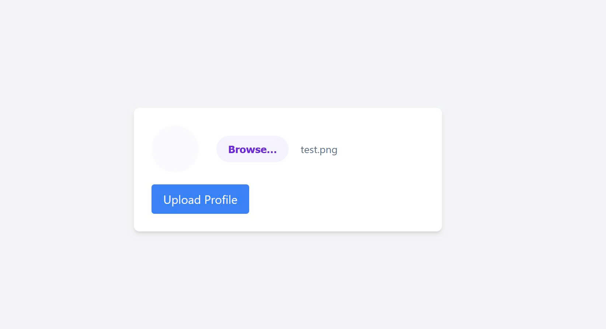
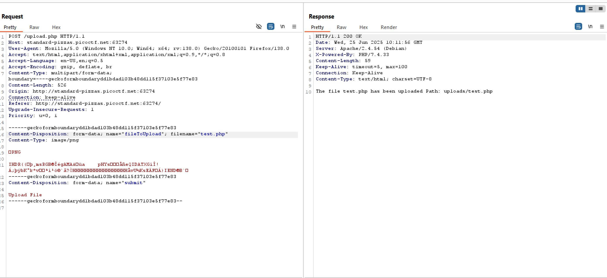
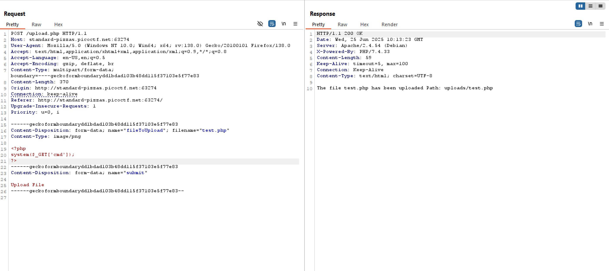
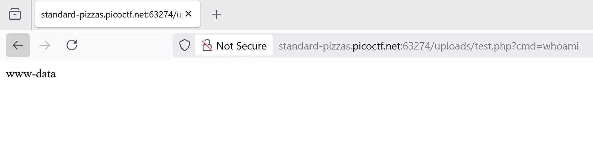
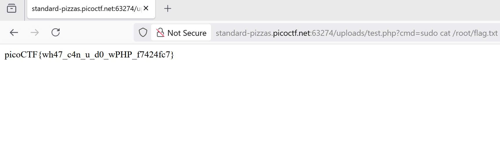

# Writeup - n0s4n1ty | PicoCTF 2025

## 🚩 Challenge Description

Phần mô tả gợi ý rằng vấn đề liên quan đến **file upload**. Cái tên “n0s4n1ty” cũng ám chỉ một thử thách điên rồ, có thể liên quan đến kiểm tra không đúng định dạng file.

→ Ngay lập tức nghĩ đến việc thử upload một **webshell PHP**.

---

## 🔍 Approach

### 1️⃣ Thử upload file ảnh hợp lệ

- Upload một file `.png` bình thường để kiểm tra chức năng upload hoạt động thế nào.

### 2️⃣ Kiểm tra upload file PHP

- Đổi đuôi file thành `.php` và upload thử.

→ Kết quả: **Upload thành công!** → Xác nhận tồn tại lỗ hổng **File Upload Vulnerability**.

### 3️⃣ Tạo Webshell PHP đơn giản

- Sửa nội dung file thành một webshell PHP và upload lên server

### 4️⃣ Thực thi lệnh qua webshell

- Thực thi lệnh qua webshell, chạy thử lệnh `whoami` -> hoạt động hoản hảo 

- Thử truy cập flag nhưng thất bại `cmd=cat /root/flag.txt`

- Thử `cmd=sudo -l`. Bất ngờ: Kết quả hiển thị rằng user `www-data` có quyền chạy bất kỳ lệnh nào với `sudo` mà không cần password!

### 5️⃣ Lấy flag

- Đọc `flag.txt` với quyền `sudo`: `cmd=sudo cat /root/flag.txt`
→ **Lấy được flag thành công. ✅**

