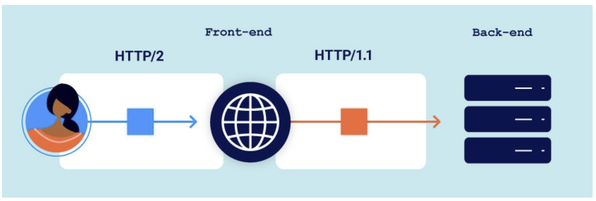

# Advanced request smuggling

Trong phần này, chúng ta sẽ phát triển tiếp các khái niệm đã học trước đó và tìm hiểu thêm một số kỹ thuật HTTP request smuggling nâng cao. Ngoài ra, phần này cũng đề cập đến nhiều kiểu tấn công dựa trên `HTTP/2`, vốn trở nên khả thi nhờ khả năng kiểm thử `HTTP/2` đặc biệt của Burp.

Cụ thể, phần này sẽ nói về:

- Cách các triển khai `HTTP/2` phổ biến vô tình mở ra nhiều hướng tấn công request smuggling mới, khiến nhiều website trước đây an toàn nay lại trở nên dễ bị khai thác.
- Cách sử dụng request smuggling để đầu độc hàng đợi phản hồi (response queue poisoning) một cách lâu dài, từ đó có thể dẫn tới chiếm quyền toàn bộ website.
- Cách tận dụng những đầu vào chỉ có ở `HTTP/2` để xây dựng các khai thác nghiêm trọng, kể cả khi front-end và back-end không hề tái sử dụng cùng một kết nối.

## HTTP/2 request smuggling

Trái với suy nghĩ phổ biến, việc triển khai `HTTP/2` trên thực tế lại khiến nhiều website dễ bị request smuggling hơn, kể cả những website trước đây vốn không gặp vấn đề này.

### HTTP/2 message length

Về bản chất, request smuggling là việc khai thác sự khác biệt trong cách các server hiểu độ dài của một request.

`HTTP/2` đưa ra một cơ chế rõ ràng và chặt chẽ hơn để xác định độ dài, nên từ lâu nhiều người cho rằng `HTTP/2` gần như miễn nhiễm với request smuggling.

Dù Burp không hiển thị điều này, nhưng trên thực tế, thông điệp `HTTP/2` được gửi đi dưới dạng một chuỗi các frame riêng biệt. Mỗi frame đều có một trường độ dài ở phía trước, cho server biết chính xác phải đọc bao nhiêu byte. Vì vậy, tổng độ dài request chính là tổng độ dài của các frame đó.

Về lý thuyết, cơ chế này khiến kẻ tấn công không còn cơ hội tạo ra sự mơ hồ cần thiết cho request smuggling, miễn là website dùng `HTTP/2` từ đầu đến cuối. Tuy nhiên, ngoài thực tế, điều này thường không đúng do một kỹ thuật rất phổ biến nhưng cũng rất nguy hiểm: `HTTP/2 downgrading`.

### HTTP/2 downgrading

`HTTP/2` downgrading là quá trình chuyển một request `HTTP/2` sang cú pháp HTTP/1 để tạo ra một request HTTP/1 tương đương.

Các web server và reverse proxy thường làm điều này để có thể hỗ trợ `HTTP/2` ở phía client, trong khi phía back-end server chỉ hiểu HTTP/1. Đây chính là điều kiện cần cho rất nhiều kiểu tấn công được trình bày trong phần này.



Lưu ý về cách biểu diễn thông điệp `HTTP/2`

- Vì `HTTP/2` là giao thức nhị phân, nên trong tài liệu, các thông điệp `HTTP/2` được trình bày theo cách dễ đọc hơn cho con người:

- Mỗi thông điệp được hiển thị như một khối duy nhất, thay vì tách thành nhiều frame.
Header được viết dưới dạng tên và giá trị bằng văn bản thuần.
Các pseudo-header được thêm dấu : ở đầu để phân biệt với header bình thường.

- Cách trình bày này khá giống với cách Burp hiển thị `HTTP/2` trong Inspector, nhưng cần nhớ rằng trên đường truyền thực tế, nó không hề trông như vậy.

### **H2.CL vulnerabilities**

Trong HTTP/2, request không cần phải tự khai báo độ dài bằng header. Khi bị downgrade sang HTTP/1, front-end server thường sẽ tự thêm header Content-Length, dựa trên cơ chế tính độ dài sẵn có của HTTP/2.

Điều thú vị là request HTTP/2 vẫn có thể tự chứa một header content-length. Trong trường hợp đó, một số front-end server sẽ đơn giản lấy luôn giá trị này và chèn vào request HTTP/1 sau khi downgrade.

Theo đặc tả, mọi header content-length trong HTTP/2 phải khớp với độ dài thực được tính bằng cơ chế nội bộ của HTTP/2. Nhưng trên thực tế, điều này không phải lúc nào cũng được kiểm tra cẩn thận trước khi downgrade.

Kết quả là kẻ tấn công có thể chèn vào một content-length sai lệch để thực hiện request smuggling. Khi đó:

- Front-end vẫn dùng cơ chế độ dài nội tại của HTTP/2 để xác định điểm kết thúc request.
- Nhưng back-end HTTP/1 lại tin vào Content-Length do kẻ tấn công chèn vào.

Sự khác biệt này sẽ tạo ra trạng thái desync giữa front-end và back-end.

**Front-end (HTTP/2)**

|            |                                  |
|------------|----------------------------------|
| `:method`  | `POST`                           |
| `:path`    | `/example`                       |
| `:authority` | `vulnerable-website.com`      |
| `content-type` | `application/x-www-form-urlencoded` |
| `content-length` | `0`                        |

```http
GET /admin HTTP/1.1
Host: vulnerable-website.com
Content-Length: 10

x=1
```

**Back-end (HTTP/1)**

```http
POST /example HTTP/1.1
Host: vulnerable-website.com
Content-Type: application/x-www-form-urlencoded
Content-Length: 0

GET /admin HTTP/1.1
Host: vulnerable-website.com
Content-Length: 10

x=1GET / H
```

> **Tips**:
>
> Khi thực hiện một số kiểu tấn công request smuggling, đôi lúc bạn sẽ muốn các header từ request của nạn nhân được nối thêm vào phần smuggled prefix mà bạn đã chèn trước đó. Tuy nhiên, trong một số trường hợp, các header này lại có thể làm hỏng quá trình tấn công, chẳng hạn gây ra lỗi trùng header hoặc những lỗi tương tự.
>
>Trong ví dụ phía trên, vấn đề này được giảm thiểu bằng cách thêm:
>
> - một tham số ở cuối, và
> - một header Content-Length
>
> vào phần smuggled prefix.
>
> Cách này hoạt động như sau: ta đặt giá trị Content-Length dài hơn phần body thật một chút. Khi đó, request của nạn nhân vẫn sẽ được nối tiếp vào smuggled prefix, nhưng nó sẽ bị cắt bớt trước khi đến phần header, nhờ vậy tránh được việc các header của nạn nhân làm ảnh hưởng tới cuộc tấn công.
>

### **H2.TE vulnerabilities**

Chunked transfer encoding không tương thích với `HTTP/2`. Đặc tả giao thức khuyến nghị rằng nếu có ai cố chèn transfer-encoding: chunked vào request `HTTP/2` thì request đó phải bị chặn hoặc header đó phải bị loại bỏ.

Tuy nhiên, nếu front-end server không làm điều này, rồi lại downgrade request sang `HTTP/1` cho một back-end có hỗ trợ chunked encoding, thì request smuggling vẫn có thể xảy ra.

Nói đơn giản:
- Front-end nhận request dưới dạng `HTTP/2`.
- Request có chứa `transfer-encoding: chunked`.
- Front-end không lọc bỏ header nguy hiểm này.
- Sau khi downgrade sang `HTTP/1`, back-end xử lý request theo chunked encoding.
- Từ đó sinh ra desync và mở đường cho request smuggling.

**Front-end (HTTP/2)**

|            |                                  |
|------------|----------------------------------|
| `:method`  | `POST`                           |
| `:path`    | `/example`                       |
| `:authority` | `vulnerable-website.com`      |
| `content-type` | `application/x-www-form-urlencoded` |
| `content-length` | `0`                        |

```http
0

GET /admin HTTP/1.1
Host: vulnerable-website.com
Foo: bar
```

**Back-end (HTTP/1)**

```http
POST /example HTTP/1.1
Host: vulnerable-website.com
Content-Type: application/x-www-form-urlencoded
Transfer-Encoding: chunked

0

GET /admin HTTP/1.1
Host: vulnerable-website.com
Foo: bar
```

### **Hidden HTTP/2 support**

Trình duyệt và các client khác, bao gồm cả Burp, thường chỉ dùng `HTTP/2` khi server chủ động thông báo rằng nó hỗ trợ `HTTP/2` thông qua ALPN trong quá trình bắt tay TLS.

Tuy nhiên, có những server thực sự hỗ trợ `HTTP/2` nhưng lại không khai báo đúng do cấu hình sai. Trong trường hợp này, từ phía client sẽ có cảm giác như server chỉ hỗ trợ `HTTP/1.1`, vì client sẽ tự động quay về dùng `HTTP/1.1` như một phương án dự phòng.

Hậu quả là người kiểm thử có thể bỏ sót bề mặt tấn công của `HTTP/2`, cũng như các lỗi ở tầng giao thức, ví dụ như request smuggling do downgrade từ `HTTP/2` mà phần trên đã nói.

#### **Cách ép Burp Repeater dùng HTTP/2**

Để kiểm tra thủ công kiểu cấu hình sai này trong Burp Repeater, bạn làm như sau:

- Vào Settings.
- Chọn Tools > Repeater.
- Ở phần Connections, bật tùy chọn `Allow HTTP/2 ALPN override`.
- Trong Repeater, mở Inspector rồi mở rộng phần Request attributes.
- Chuyển Protocol sang `HTTP/2`.

Sau đó, Burp sẽ gửi toàn bộ request ở tab đó bằng `HTTP/2`, kể cả khi server không quảng bá hỗ trợ `HTTP/2`.

Nếu bạn dùng Burp Suite Professional, Burp Scanner có thể tự động phát hiện tình huống hidden `HTTP/2` support này.


### **HTTP/2-exclusive vectors**

#### **Chèn payload thông qua tên header**

Trong `HTTP/1`, tên của header không thể chứa dấu hai chấm `:`, vì ký tự này được parser dùng để xác định điểm kết thúc tên header. Nhưng trong `HTTP/2` thì không bị ràng buộc như vậy.

Bằng cách kết hợp dấu : với ký tự `\r\n`, bạn có thể lợi dụng trường tên của header trong `HTTP/2` để lén đưa thêm các header khác vượt qua bộ lọc ở front-end. Sau đó, khi request bị chuyển về `HTTP/1`, back-end sẽ hiểu chúng thành các header tách biệt.

Ví dụ:

Front-end nhìn thấy dưới dạng `HTTP/2`:
```http
foo: bar\r\nTransfer-Encoding: chunked\r\nX: ignore
```

Back-end hiểu dưới dạng `HTTP/1`:
```http
Foo: bar
Transfer-Encoding: chunked
X: ignore
```

#### **Chèn payload thông qua pseudo-header**

`HTTP/2` không dùng request line hay status line như `HTTP/1`. Thay vào đó, các thông tin này được truyền bằng một loạt pseudo-header ở đầu request. Trong cách biểu diễn dễ đọc, các pseudo-header thường có dấu `:` ở đầu để phân biệt với header bình thường.

`HTTP/2` có tổng cộng 5 pseudo-header:
```
:method – phương thức request
:path` – đường dẫn request, bao gồm cả query string
:authority – gần tương đương với header Host của HTTP/1
:scheme – giao thức, thường là http hoặc https
:status – mã trạng thái response, không dùng trong request
```
Khi website hạ cấp request từ `HTTP/2` xuống `HTTP/1`, giá trị của một số pseudo-header này sẽ được dùng để tạo động request line. Điều đó mở ra nhiều cách tấn công mới.

#### **Cung cấp host mơ hồ**

Dù trong HTTP/2, header Host về cơ bản được thay bằng pseudo-header :authority, bạn vẫn được phép gửi thêm cả header Host thường trong request.

Trong một số trường hợp, việc này có thể khiến request HTTP/1 sau khi bị rewrite chứa hai header Host. Điều này mở ra khả năng bypass các bộ lọc ở front-end, ví dụ như bộ lọc chặn duplicate Host header.

Kết quả là website có thể trở nên dễ bị nhiều kiểu Host header attack, dù bình thường nó vốn miễn nhiễm với các kiểu tấn công đó.

#### **Cung cấp path mơ hồ**

Trong HTTP/1, bạn gần như không thể gửi một request có path mơ hồ, vì request line được phân tích rất chặt chẽ.

Nhưng trong HTTP/2, path được truyền bằng pseudo-header, nên có thể gửi request có hai path khác nhau, ví dụ:
```
:method POST
:path /anything
:path /admin
:authority vulnerable-website.com
```
Nếu website kiểm tra quyền truy cập dựa trên một path nhưng lại định tuyến request theo path còn lại, bạn có thể truy cập vào những endpoint vốn bị cấm

#### **Chèn cả một request line hoàn chỉnh**

Khi request bị downgrade, giá trị của pseudo-header `:method` sẽ được ghi vào đầu tiên trong request `HTTP/1` mới tạo ra.

Nếu server cho phép bạn chèn dấu cách vào giá trị của `:method`, bạn có thể chèn cả một request line khác hoàn chỉnh. Ví dụ:

**Front-end (HTTP/2):**
```http
:method GET /admin HTTP/1.1
:path /anything
:authority vulnerable-website.com
```
**Back-end (HTTP/1):**
```http
GET /admin HTTP/1.1 /anything HTTP/1.1
Host: vulnerable-website.com
```
Nếu server vẫn chấp nhận những ký tự thừa ở cuối request line, đây sẽ là một cách khác để tạo ra đường dẫn mơ hồ.

#### **Chèn tiền tố URL**


Một điểm thú vị khác của HTTP/2 là bạn có thể chỉ định rõ scheme ngay trong request bằng pseudo-header `:scheme`.

Thông thường, giá trị này chỉ là `http` hoặc `https`, nhưng trong một số trường hợp bạn có thể chèn giá trị tùy ý.

Điều này đặc biệt hữu ích nếu server dùng `:scheme` để tạo URL động. Khi đó, bạn có thể thêm tiền tố vào URL, thậm chí ghi đè URL hoàn toàn bằng cách đẩy URL thật xuống phần query string.

Ví dụ:

**Request**
```
:method GET
:path /anything
:authority vulnerable-website.com
:scheme https://evil-user.net/poison?
```
**Response**
```
:status 301
location https://evil-user.net/poison?://vulnerable-website.com/anything/
```
Ý nghĩa là server đã vô tình tạo ra một URL chuyển hướng theo giá trị mà kẻ tấn công chèn vào.


#### **Chèn ký tự xuống dòng vào pseudo-header**

Khi chèn payload vào `:path` hoặc `:method`, bạn phải đảm bảo rằng request HTTP/1 sau khi bị rewrite vẫn giữ được request line hợp lệ.

Trong HTTP/1, chuỗi `\r\n` dùng để kết thúc request line. Vì vậy, nếu bạn chèn `\r\n` vào giữa chừng mà không tính toán kỹ, request sẽ bị hỏng.

Sau khi downgrade, request hợp lệ phải có cấu trúc như sau trước ký tự `\r\n` đầu tiên mà bạn chèn vào:
```http
<method> + khoảng trắng + <path> + khoảng trắng + HTTP/1.1
```
Nói đơn giản, bạn phải hình dung xem payload của mình nằm ở vị trí nào trong chuỗi trên, rồi tự thêm nốt các phần còn thiếu cho đúng.

Ví dụ, nếu chèn vào `:path`, bạn cần thêm một dấu cách và HTTP/1.1 trước `\r\n`, như sau:

**Front-end (HTTP/2):**
```http
:method GET
:path /example HTTP/1.1\r\n
Transfer-Encoding: chunked\r\n
X: x
:authority vulnerable-website.com
```
**Back-end (HTTP/1):**
```http
GET /example HTTP/1.1
Transfer-Encoding: chunked
X: x HTTP/1.1
Host: vulnerable-website.com
``` 

### **Request smuggling via CRLF injection**

Ngay cả khi website đã cố ngăn chặn các kiểu H2.CL hoặc H2.TE cơ bản, ví dụ như:

- kiểm tra chặt chẽ `content-length`, hoặc
- tự động xóa mọi header `transfer-encoding`,

thì định dạng nhị phân của HTTP/2 vẫn tạo ra một số cách bypass mới.

Trong HTTP/1, đôi khi có thể lợi dụng sự khác nhau giữa các server trong cách xử lý ký tự xuống dòng đơn `\n` để lén chèn thêm header bị cấm. Nếu back-end coi `\n` là dấu phân cách header còn front-end thì không, front-end có thể không hề nhận ra header thứ hai đã bị chèn vào.

Ví dụ:
```
Foo: bar\nTransfer-Encoding: chunked
```
Với chuỗi đầy đủ `\r\n`, sự khác biệt này không tồn tại trong HTTP/1, vì mọi server HTTP/1 đều hiểu đó là dấu kết thúc header.

Nhưng với HTTP/2 thì khác. Vì đây là giao thức nhị phân, ranh giới của từng header không còn dựa vào ký tự phân cách nữa, mà dựa vào các vị trí đã được xác định sẵn. Điều đó có nghĩa là `\r\n` không còn mang ý nghĩa đặc biệt khi nó nằm bên trong giá trị của một header. Nó có thể tồn tại như một phần bình thường của giá trị.

Ví dụ một header trong HTTP/2 có thể chứa:
```
foo: bar\r\nTransfer-Encoding: chunked
```
Khi còn ở HTTP/2, điều này nhìn có vẻ vô hại. Nhưng sau khi bị rewrite thành HTTP/1, chuỗi `\r\n` lại được hiểu là ký tự phân tách header. Khi đó back-end HTTP/1 sẽ hiểu thành hai header riêng biệt:
```http
Foo: bar
Transfer-Encoding: chunked
```
Và như vậy, request smuggling lại trở nên khả thi.

### **Response queue poisoning**

Response queue poisoning là một dạng tấn công mạnh của request smuggling. Nó làm cho server front-end bắt đầu ghép nhầm phản hồi từ back-end vào sai request.

Nói đơn giản hơn:

- Bình thường: request nào thì nhận response của request đó.
- Khi bị đầu độc hàng đợi phản hồi: người này gửi request nhưng lại nhận response dành cho người khác.

Trong thực tế, điều này có nghĩa là mọi người dùng đi chung một kết nối front-end/back-end có thể liên tục bị trả về những phản hồi vốn không dành cho họ.

Điều này xảy ra khi kẻ tấn công nhét lậu (smuggle) được một request hoàn chỉnh, khiến back-end trả về 2 response, trong khi front-end chỉ nghĩ là sẽ có 1 response.

**Smuggling một phần đầu request (Smuggling a prefix)**

Nếu bạn smuggle một request mà có cả body, thì request tiếp theo trên cùng kết nối sẽ bị nối vào body của request bị smuggle.

Hậu quả thường là:

- request cuối bị cắt ngắn theo `Content-Length`
- back-end thực tế nhìn thấy 3 request
- nhưng request thứ 3 chỉ là mớ byte thừa, không phải request hợp lệ

Ví dụ:
```http
POST / HTTP/1.1
Host: vulnerable-website.com
Content-Type: x-www-form-urlencoded
Content-Length: 120
Transfer-Encoding: chunked

0

POST /example HTTP/1.1
Host: vulnerable-website.com
Content-Type: x-www-form-urlencoded
Content-Length: 25

x=GET / HTTP/1.1
Host: vulnerable-website.com
```
**Front-end (CL)** hiểu theo `Content-Length`

```
POST / HTTP/1.1
Host: vulnerable-website.com
Content-Type: x-www-form-urlencoded
Content-Length: 120
Transfer-Encoding: chunked

0

POST /example HTTP/1.1
Host: vulnerable-website.com
Content-Type: x-www-form-urlencoded
Content-Length: 25

x=
```


**Back-end (TE)** theo chunked
```http
POST / HTTP/1.1
Host: vulnerable-website.com
Content-Type: x-www-form-urlencoded
Content-Length: 120
Transfer-Encoding: chunked

0
```
```http
POST /example HTTP/1.1
Host: vulnerable-website.com
Content-Type: x-www-form-urlencoded
Content-Length: 25

x=GET / HTTP/1.1
Host: v
```
```
ulnerable-website.com
```
Vì phần byte còn dư này không tạo thành một request hợp lệ, nên server thường sẽ báo lỗi và đóng kết nối.

**Smuggling một request hoàn chỉnh (Smuggling a complete request)**

Nếu cẩn thận hơn, bạn có thể smuggle một request hoàn chỉnh, thay vì chỉ smuggle phần đầu.

Miễn là bạn gửi khéo để trong một lần gửi có đúng 2 request hoàn chỉnh, thì các request đến sau trên cùng kết nối sẽ không bị hỏng.

Ví dụ: 

```http
POST / HTTP/1.1\r\n
Host: vulnerable-website.com\r\n
Content-Type: x-www-form-urlencoded\r\n
Content-Length: 61\r\n
Transfer-Encoding: chunked\r\n
\r\n
0\r\n
\r\n
GET /anything HTTP/1.1\r\n
Host: vulnerable-website.com\r\n
\r\n
GET / HTTP/1.1\r\n
Host: vulnerable-website.com\r\n
\r\n
```

Ở đây, back-end không nhận request lỗi nào cả, nên kết nối thường vẫn được giữ mở sau cuộc tấn công.

**Làm lệch hàng đợi phản hồi**

Khi bạn smuggle một request hoàn chỉnh:

- front-end vẫn nghĩ rằng nó chỉ vừa chuyển tiếp 1 request
- nhưng back-end thực tế thấy 2 request riêng biệt
- vì vậy back-end sẽ trả về 2 response

#### **Poisoning the response queue**

Front-end sẽ xử lý như sau:

- nó ghép response đầu tiên với request “bọc ngoài” ban đầu và gửi về cho client
- nhưng lúc này response thứ hai trở thành response thừa, vì front-end không biết là còn một request nữa đã được xử lý ở back-end
- response thừa này sẽ bị giữ lại trong hàng đợi trên kết nối giữa front-end và back-end

Sau đó, khi front-end nhận một request mới từ ai đó:

- nó chuyển request đó sang back-end như bình thường
- nhưng khi cần trả response, nó lại lấy response đầu tiên đang chờ trong hàng đợi
- tức là response cũ còn sót lại của request bị smuggle

Kết quả:

- người dùng mới nhận nhầm response
- còn response đúng của request mới lại tiếp tục bị “kẹt” lại
- quá trình này cứ lặp đi lặp lại mỗi khi có request mới đi qua cùng kết nối

#### **Đánh cắp phản hồi của người dùng khác**

Sau khi hàng đợi phản hồi đã bị đầu độc, kẻ tấn công chỉ cần gửi một request bất kỳ để nhận response của người dùng khác.

Tuy nhiên, kẻ tấn công không thể chọn chính xác response của ai sẽ nhận được.
Họ luôn nhận response tiếp theo trong hàng đợi, tức là thường là response dành cho request của người dùng trước đó.

Trong một số trường hợp, response lấy được có thể không quá giá trị. Nhưng nếu dùng công cụ như Burp Intruder để tự động gửi đi gửi lại request nhiều lần, kẻ tấn công có thể:

- thu thập được rất nhiều response của nhiều người dùng khác nhau
- trong số đó có thể có những response chứa dữ liệu hữu ích, nhạy cảm

Kẻ tấn công có thể tiếp tục ăn cắp response như vậy chừng nào kết nối front-end/back-end vẫn còn mở.

Việc kết nối bị đóng khi nào còn tùy từng server, nhưng một cấu hình mặc định khá phổ biến là: kết nối sẽ bị đóng sau khi xử lý khoảng 100 request. Ngoài ra, khi một kết nối bị đóng, kẻ tấn công cũng có thể đầu độc lại một kết nối mới rất dễ dàng.

>**Tips**
>
>Để dễ phân biệt các phản hồi bị lấy cắp với các phản hồi trả về cho chính request của bạn, hãy thử dùng một đường dẫn không tồn tại trong cả hai request mà bạn gửi.
>
>Làm như vậy, các request của chính bạn sẽ luôn nhận về phản hồi `404 Not Found`
#### **Tóm lại:**

- Kẻ tấn công lén nhét thêm 1 request hoàn chỉnh
- Back-end xử lý thành 2 request nên tạo ra 2 response
- Front-end lại chỉ nghĩ có 1 request
- Thế là 1 response bị dư ra
- Response dư này nằm chờ trong hàng đợi
- Người gửi request tiếp theo sẽ bị nhận nhầm response của người trước
- Kẻ tấn công lợi dụng điều đó để móc trộm dữ liệu của người khác

### **HTTP/2 request splitting**

Khi học về response queue poisoning, bạn đã thấy cách tách một HTTP request thành đúng hai request hoàn chỉnh ở phía back-end. Trong ví dụ trước, điểm tách nằm trong phần body.

Nhưng khi có HTTP/2 downgrading, bạn còn có thể làm cho điểm tách xuất hiện ngay trong phần header.

Cách này linh hoạt hơn vì bạn không còn phụ thuộc vào các phương thức có body như POST nữa. Thậm chí bạn có thể dùng cả GET request để khai thác.

Điều này đặc biệt hữu ích trong các trường hợp:

- `content-length` bị kiểm tra rất chặt,
- hoặc back-end không hỗ trợ chunked encoding.

#### **Cần tính đến việc front-end sẽ rewrite request**

Khi muốn tách request ngay trong header, bạn phải hiểu rõ front-end sẽ rewrite request như thế nào, rồi tính trước điều đó khi tự chèn các header HTTP/1 bằng tay. Nếu không, một trong hai request sau khi bị tách có thể sẽ thiếu những header bắt buộc.

Ví dụ, cả hai request đi tới back-end đều cần có header Host.

Thông thường, front-end server sẽ bỏ pseudo-header `:authority` rồi tạo ra một header Host mới trong request HTTP/1 khi thực hiện downgrade. Tuy nhiên, cách và vị trí chèn Host này có thể khác nhau giữa các front-end server.

Nếu front-end thêm header Host mới vào cuối danh sách header, thì có thể điểm tách request trên back-end lại xảy ra trước khi header Host đó xuất hiện. Khi đó:

- request đầu tiên sẽ không có Host,
- còn request bị smuggle sẽ có tới hai Host.

Trong trường hợp như vậy, bạn phải tự chèn Host sao cho sau khi request bị tách, request đầu tiên vẫn có đủ header bắt buộc.

Tương tự, các header nội bộ khác mà bạn muốn chèn vào cũng phải được đặt đúng vị trí.

### **HTTP request tunnelling**

Nhiều kiểu tấn công request smuggling trước đây chỉ khả thi khi front-end và back-end tái sử dụng cùng một kết nối để xử lý nhiều request.

Tuy nhiên, HTTP request tunnelling mở ra một cách khai thác nghiêm trọng ngay cả khi hoàn toàn không có connection reuse.

#### **0.CL request smuggling**

Tấn công 0.CL desync xảy ra khi:

- front-end bỏ qua header `Content-Length`,
- nhưng back-end lại xử lý header này.

Trong thời gian dài, tình huống này được xem là gần như không thể khai thác vì sẽ dẫn tới trạng thái “kẹt” kết nối giữa các server.

Tuy nhiên, nếu kết hợp `0.CL` với một early-response gadget - tức là một kỹ thuật khiến back-end trả lời sớm trước khi nhận đủ toàn bộ body của request - thì kẻ tấn công có thể phá vỡ trạng thái bế tắc đó. Sau đó, họ tiếp tục dùng double desync để xây dựng khai thác hoàn chỉnh.

Đây là một bước đột phá, vì nó chứng minh rằng các kịch bản `0.CL` thực ra vẫn có thể bị khai thác.