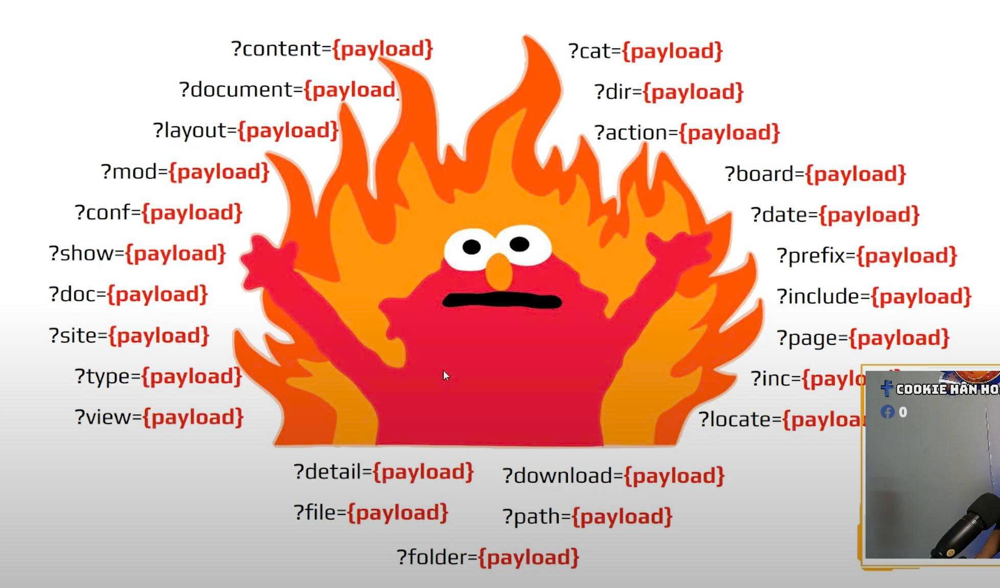

## Warm up

- Absolute Path: /usr/bin/hello.txt
- Relative Path: ./hello.txt
    Một dấu chấm thể hiện thư mục hiện tại
    Hai dấu chấm thể hiện thư mục cha

#### Ví dụ: 
    ./hello.txt → thư mục hiện tại: bin
    cd ../hello.txt → usr

### Tất cả những chức năng liên quan đến việc XỬ LÝ FILE sẽ có khả năng bị lỗi Path Traversal
    - Download / Upload
    - Import / Export
    - Menu động
    - Load Resource
    - Zip / Unzip
    - Xử lý hình ảnh

### Cách tìm lỗ hổng
#### Quan sát và xác định các hàm số liên quan đến:
- Tên file
- Đường dẫn (Path)
- URL
    
<!-- #### Top 25 tham số hay xuất hiện lỗ hổng

 -->

### Cách ngăn chặn

#### Sử dụng backlist để ngăn chặn Path Traversal (thay thế ../ thành "")

    $input = str_replace('../', '', $input);

    '../' → '' ❌
    '..././' → '../' (bypassed) ✅

#### Sử dụng đệ quy để thực hiện xóa

    while(substr_count($input, '../', 0)) {
        $input = str_replace('../', '', $input);
    };

    ../ → (xóa) → ❌
    .../../ → ../ → (xóa) → ❌

#### → Sử dụng **Blacklist** để ngăn chặn Path Traversal không phải là giải pháp an toàn và tối ưu

### Remediation

- Lọc và loại bỏ các **ký tự đặc biệt** trong tên File hoặc Folder
- Chỉ sử dụng đường dẫn tuyệt đối khi xử lý File
- Lưu trữ File ở **Cloud Storage**
- Thực hiện đổi tên File thành dạng Hash sau khi **Upload**
- Ngăn **Shell Code** thực thi trong thư mục **Upload**

### Làm thế nào để vô hiệu hóa ".pdf" được hardcoded trong mã nguồn
#### Null-Byte Bypass

    - Null Byte sẽ chấm dứt một chuỗi (Null Terminator)
    - Ký hiệu: %00, \x00
    - Hoạt động với đa số các ngôn ngữ lập trình: Perl, PHP, Java, ASP, ASP.Net, C, ...

    - Null byte (\x00) thường được dùng để kết thúc chuỗi trong ngôn ngữ C và nhiều API thấp. Khi xuất hiện trong đường dẫn (ví dụ: ../../../etc/passwd%00.jpg), nó có thể làm hệ thống hiểu rằng phần mở rộng .jpg không tồn tại, và chỉ xử lý phần ../../../etc/passwd.

    - Lưu ý: Null Byte Injection đã được sửa lỗi từ phiên bản PHP 5.3.4

#### Bài ví dụ: 
- Under construction
- File Download
- Baby OS Path
- Path Traversal
- Upload File Path Traversal
- Unzip me now
- CVE-2021-43798
- CVE-2023-1177
- CVE-2021-4173 HTTPD
- Mutation Lab
- Flask Dev

