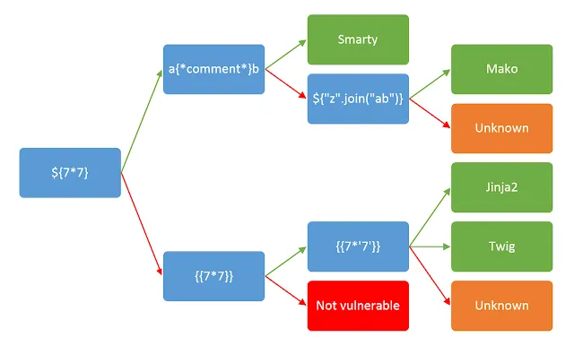

# Server-side template injection (SSTI)

**Server-side template injection** (SSTI) là khi kẻ tấn công có thể sử dụng cú pháp gốc của hệ thống template để chèn một payload độc hại vào template, và payload này được thực thi ở phía máy chủ.

Các **template engine** được thiết kế để tạo trang web bằng cách kết hợp các mẫu (template) cố định với dữ liệu biến đổi. Tấn công SSTI có thể xảy ra khi đầu vào của người dùng được **nối trực tiếp** vào template thay vì được truyền vào như **dữ liệu**. Điều này cho phép kẻ tấn công chèn các **chỉ thị (directive) của template** tùy ý nhằm thao túng template engine, thường dẫn đến khả năng chiếm quyền kiểm soát hoàn toàn máy chủ. Đúng như tên gọi, các payload SSTI được gửi và **đánh giá (evaluate) ở phía máy chủ**, khiến chúng tiềm ẩn nguy hiểm hơn nhiều so với các kiểu **client-side template injection** thông thường.

# Hậu quả
Các lỗ hổng server-side template injection có thể phơi bày website trước nhiều kiểu tấn công khác nhau tùy thuộc vào template engine liên quan và cách ứng dụng sử dụng nó. Trong một số trường hợp hiếm hoi, các lỗ hổng này không gây rủi ro bảo mật đáng kể. Tuy nhiên, hầu hết thời gian, tác động của server-side template injection có thể là thảm khốc.

Ở mức độ nghiêm trọng nhất, kẻ tấn công có thể đạt được **remote code execution (RCE)**, giành quyền kiểm soát hoàn toàn máy chủ back-end và sử dụng nó để thực hiện các cuộc tấn công khác vào hạ tầng nội bộ.

Ngay cả khi không thể thực thi mã từ xa hoàn toàn, kẻ tấn công vẫn thường có thể dùng server-side template injection làm nền tảng cho vô số cuộc tấn công khác, có khả năng chiếm quyền đọc dữ liệu nhạy cảm và các tệp tùy ý trên máy chủ.

# Nguyên nhân
Lỗ hổng server-side template injection phát sinh khi đầu vào của người dùng bị nối (concatenate) trực tiếp vào template thay vì được truyền vào như dữ liệu.

Các template tĩnh chỉ cung cấp các placeholder để nội dung động được render vào nói chung **không dễ** bị SSTI. Ví dụ kinh điển là email chào người dùng bằng tên của họ, như trích đoạn từ template Twig sau:

```php
$output = $twig->render("Dear {first_name},", array("first_name" => $user.first_name) );
```

Đoạn này **không** dễ bị SSTI vì tên người dùng chỉ được truyền vào template như **dữ liệu**.

Tuy nhiên, vì template thực chất chỉ là chuỗi, đôi khi lập trình viên web sẽ nối trực tiếp đầu vào người dùng vào template trước khi render. Hãy xét một ví dụ tương tự như trên, nhưng lần này người dùng có thể tùy biến một phần email trước khi gửi. Chẳng hạn, họ có thể chọn cái tên được sử dụng:

```php
$output = $twig->render("Dear " . $_GET['name']);
```

Trong ví dụ này, thay vì truyền một giá trị tĩnh vào template, **một phần của chính template** lại được tạo động bằng tham số GET `name`. Do cú pháp template được đánh giá (evaluate) ở phía máy chủ, điều này có thể cho phép kẻ tấn công đặt một payload SSTI vào tham số `name` như sau:

```
http://vulnerable-website.com/?name={{bad-stuff-here}}
```

Những lỗ hổng kiểu này đôi khi xảy ra **vô tình** do thiết kế template kém của những người không quen với hệ quả bảo mật. Như ví dụ trên, bạn có thể thấy các thành phần khác nhau - một số chứa đầu vào người dùng - bị nối lại rồi nhúng vào template. Ở một khía cạnh nào đó, điều này tương tự lỗ hổng SQL injection xảy ra trong các prepared statement viết kém.

Tuy nhiên, đôi khi hành vi này lại được **cố ý** triển khai. Ví dụ, một số website thiết kế cho phép một số người dùng có đặc quyền nhất định, như biên tập viên nội dung, chỉnh sửa hoặc gửi các template tùy chỉnh. Rõ ràng, điều này gây ra rủi ro bảo mật rất lớn nếu kẻ tấn công chiếm được một tài khoản có đặc quyền như vậy.

## Detect (Phát hiện)
Các lỗ hổng server-side template injection (SSTI) thường bị bỏ qua không phải vì chúng phức tạp, mà vì chúng chỉ thực sự rõ ràng với những người kiểm thử chủ đích tìm kiếm chúng. Nếu bạn phát hiện được rằng có lỗ hổng hiện diện, việc khai thác có thể bất ngờ dễ dàng, đặc biệt trong các môi trường không bị sandbox.

Giống như mọi lỗ hổng khác, bước đầu tiên để khai thác là có thể **tìm ra nó**. Cách tiếp cận ban đầu đơn giản nhất có lẽ là thử fuzz template bằng cách chèn một chuỗi các ký tự đặc biệt thường dùng trong biểu thức template, chẳng hạn: `\${{<%[%'"}}%\`. Nếu có ngoại lệ (exception) được ném ra, điều này cho thấy cú pháp template bạn chèn vào **có khả năng** đang được máy chủ diễn giải theo một cách nào đó. Đây là một dấu hiệu cho thấy có thể tồn tại lỗ hổng SSTI.

Lỗ hổng SSTI xảy ra trong **hai ngữ cảnh riêng biệt**, mỗi ngữ cảnh đòi hỏi một phương pháp phát hiện riêng. Bất kể kết quả fuzzing của bạn ra sao, điều quan trọng là cũng phải thử các cách tiếp cận **đặc thù theo ngữ cảnh** sau. Nếu fuzzing không ngã ngũ, lỗ hổng vẫn có thể lộ diện khi dùng một trong các cách này. Ngay cả khi fuzzing có gợi ý về một lỗ hổng template injection, bạn vẫn cần xác định **ngữ cảnh** của nó để có thể khai thác.


### Plaintext context


Hầu hết các ngôn ngữ template cho phép bạn tự do đưa nội dung vào hoặc bằng cách dùng trực tiếp các thẻ HTML, hoặc bằng cú pháp gốc của template, nội dung này sẽ được render thành HTML ở back-end trước khi HTTP response được gửi đi. Ví dụ, trong Freemarker, dòng `render('Hello ' + username)` sẽ được render thành dạng như **Hello Carlos**.

Đôi khi điều này có thể bị khai thác cho XSS và thực tế thường bị nhầm là một lỗ hổng XSS đơn giản. Tuy nhiên, bằng cách đặt các phép toán học làm giá trị của tham số, chúng ta có thể kiểm tra liệu đây cũng là một điểm vào tiềm năng cho tấn công server-side template injection hay không.

Ví dụ, xét một template chứa đoạn mã dễ bị tổn thương sau:

```php
render('Hello ' + username)
```

Trong quá trình kiểm thử, chúng ta có thể kiểm tra server-side template injection bằng cách gửi yêu cầu đến URL như:

```
http://vulnerable-website.com/?username=${7*7}
```

Nếu kết quả hiển thị **Hello 49**, điều này cho thấy phép toán học đang được đánh giá ở phía máy chủ. Đây là một proof-of-concept (PoC) tốt cho lỗ hổng server-side template injection.

Lưu ý rằng cú pháp cụ thể cần dùng để đánh giá thành công phép toán sẽ khác nhau tùy thuộc vào template engine được sử dụng. Chúng ta sẽ bàn chi tiết hơn ở bước **Identify (Nhận diện)**.


### Code context
Trong các trường hợp khác, lỗ hổng lộ ra khi đầu vào của người dùng được đặt bên trong một biểu thức template, như chúng ta đã thấy với ví dụ email trước đó. Điều này có thể ở dạng tên biến do người dùng kiểm soát được đặt bên trong một tham số, chẳng hạn:

```php
greeting = getQueryParameter('greeting')
engine.render("Hello {{"+greeting+"}}", data)

```

Trên website, URL thu được sẽ giống như:

```
http://vulnerable-website.com/?greeting=data.username
```

Ví dụ, điều này sẽ được render trong đầu ra thành **Hello Carlos**.

Ngữ cảnh này dễ bị bỏ sót trong quá trình đánh giá vì nó không dẫn đến XSS rõ ràng và gần như không thể phân biệt với một thao tác tra cứu hashmap đơn giản. Một phương pháp để kiểm tra server-side template injection trong ngữ cảnh này là trước tiên xác nhận rằng tham số không chứa lỗ hổng XSS trực tiếp bằng cách chèn HTML tùy ý vào giá trị:

```
http://vulnerable-website.com/?greeting=data.username<tag>
```

Khi không có XSS, điều này thường sẽ dẫn đến một mục trống trong đầu ra (chỉ có “Hello” mà không có username), thẻ được mã hóa, hoặc một thông báo lỗi. Bước tiếp theo là thử phá vỡ câu lệnh bằng cách dùng cú pháp template phổ biến và cố gắng chèn HTML tùy ý phía sau:

```
http://vulnerable-website.com/?greeting=data.username}}<tag>
```

Nếu một lần nữa điều này dẫn đến lỗi hoặc đầu ra trống, bạn đã dùng sai cú pháp của ngôn ngữ template, hoặc nếu không có cú pháp kiểu template nào có vẻ hợp lệ, thì server-side template injection không khả thi. Ngược lại, nếu đầu ra được render đúng cùng với HTML tùy ý, đây là chỉ dấu quan trọng cho thấy đang tồn tại lỗ hổng server-side template injection:

```
Hello Carlos<tag>
```


## Identify (Nhận diện)


Khi bạn đã phát hiện tiềm năng injection trong template, bước tiếp theo là xác định template engine đang được sử dụng.

Mặc dù có rất nhiều ngôn ngữ template, phần lớn chúng dùng cú pháp khá giống nhau và được chọn sao cho không xung đột với các ký tự HTML. Do đó, việc tạo các payload thăm dò để kiểm tra xem template engine nào đang được dùng có thể tương đối đơn giản.

Chỉ cần gửi **cú pháp không hợp lệ** thường là đủ, vì thông báo lỗi trả về sẽ cho bạn biết chính xác template engine là gì, thậm chí đôi khi cả phiên bản. Ví dụ, biểu thức không hợp lệ `<%=foobar%>` sẽ kích hoạt phản hồi sau từ ERB (Ruby):

```
(erb):1:in `<main>': undefined local variable or method `foobar' for main:Object (NameError)
from /usr/lib/ruby/2.5.0/erb.rb:876:in `eval'
from /usr/lib/ruby/2.5.0/erb.rb:876:in `result'
from -e:4:in `<main>'
```

Nếu không có lỗi tiết lộ, bạn sẽ cần **thử thủ công** các payload đặc thù theo ngôn ngữ và quan sát cách template engine diễn giải chúng. Bằng phương pháp loại trừ dựa trên cú pháp nào **hợp lệ** hoặc **không hợp lệ**, bạn có thể nhanh chóng thu hẹp phạm vi. Cách làm phổ biến là **chèn các phép toán** tùy ý bằng cú pháp của các template engine khác nhau rồi quan sát xem chúng có được đánh giá (evaluate) thành công hay không. Để hỗ trợ quá trình này, bạn có thể dùng một **cây quyết định** tương tự như sau:



Bạn cần lưu ý rằng **cùng một payload** đôi khi có thể trả về kết quả “thành công” trong **hơn một** ngôn ngữ template. Ví dụ, payload `{{7*'7'}}` trả về `49` trong **Twig** và `7777777` trong **Jinja2**. Do đó, **không nên vội kết luận** chỉ dựa trên **một** phản hồi thành công.


## Exploit (Khai thác)


Trong phần này, chúng ta sẽ xem xét kỹ hơn một số lỗ hổng server-side template injection điển hình và minh họa cách chúng có thể được khai thác bằng phương pháp luận cấp cao của chúng tôi. Bằng cách đưa quy trình này vào thực tế, bạn có thể phát hiện và khai thác nhiều loại lỗ hổng server-side template injection khác nhau.

Khi bạn phát hiện ra một lỗ hổng server-side template injection và nhận diện được template engine đang được sử dụng, việc khai thác thành công thường bao gồm quy trình sau.

- Read
    - Template syntax
    - Security documentation
    - Documented exploits
- Explore the environment
- Create a custom attack


### Read


Trừ khi bạn đã nắm rõ template engine từ trong ra ngoài, việc đọc tài liệu của nó thường là điểm khởi đầu. Dù đây có thể không phải cách thú vị nhất để dành thời gian, nhưng điều quan trọng là không được đánh giá thấp mức độ hữu ích của tài liệu như một nguồn thông tin.

> **Template syntax**
> 

Việc học cú pháp cơ bản dĩ nhiên là quan trọng, cùng với các hàm then chốt và cách xử lý biến. Ngay cả những điều đơn giản như học cách nhúng các khối mã gốc (native code) vào template đôi khi cũng có thể nhanh chóng dẫn đến một khai thác. Ví dụ, khi bạn biết rằng template engine Mako (dựa trên Python) đang được sử dụng, đạt được thực thi mã từ xa có thể đơn giản như:

```python
<%
import os
x=os.popen('id').read()
%>
${x}
```

Trong một môi trường không bị sandbox, việc đạt được thực thi mã từ xa và dùng nó để đọc, sửa, hoặc xóa các tệp tùy ý cũng tương tự đơn giản trong nhiều template engine phổ biến.

> Security Documentation
> 

Bên cạnh việc cung cấp những kiến thức nền tảng về cách tạo và sử dụng template, tài liệu (documentation) cũng có thể có một phần “Security”. Tên phần này có thể khác nhau, nhưng thường sẽ nêu ra tất cả những điều tiềm ẩn nguy hiểm mà mọi người nên tránh khi làm việc với template. Đây có thể là một nguồn lực vô giá, thậm chí đóng vai trò như một “cheat sheet” về các hành vi bạn nên tìm kiếm trong quá trình kiểm thử, cũng như cách khai thác chúng.

Ngay cả khi không có phần “Security” riêng, nếu một đối tượng (object) hay hàm (function) dựng sẵn nào đó có thể tạo rủi ro bảo mật, gần như luôn có một cảnh báo nào đó trong tài liệu. Cảnh báo có thể không cung cấp nhiều chi tiết, nhưng tối thiểu cũng sẽ đánh dấu built-in cụ thể này là thứ cần điều tra.

Ví dụ, trong ERB, tài liệu cho thấy bạn có thể liệt kê tất cả thư mục và sau đó đọc các tệp tùy ý như sau:

```php
<%= Dir.entries('/') %>
<%= File.open('/example/arbitrary-file').read %>
```

### Explore the environment
Ở giai đoạn này, bạn có thể đã tình cờ tìm được một khai thác khả thi nhờ đọc tài liệu. Nếu chưa, bước tiếp theo là **khám phá môi trường** và cố gắng tìm ra toàn bộ các đối tượng mà bạn có quyền truy cập.

Nhiều template engine phơi bày một đối tượng “self” hoặc “environment” nào đó, hoạt động như một **namespace** chứa tất cả các đối tượng, phương thức và thuộc tính được template engine hỗ trợ. Nếu tồn tại đối tượng như vậy, bạn có thể tận dụng nó để tạo danh sách các đối tượng đang nằm trong **scope**. Ví dụ, trong các ngôn ngữ template dựa trên Java, đôi khi bạn có thể liệt kê tất cả biến trong môi trường bằng payload sau:

```java
${T(java.lang.System).getenv()}
```

Điều này có thể làm nền tảng để tạo một **shortlist** các đối tượng và phương thức tiềm năng đáng quan tâm để điều tra sâu hơn. Ngoài ra, với người dùng **Burp Suite Professional**, Intruder cung cấp sẵn một **wordlist tích hợp** để brute-force tên biến.

> **Developer-supplied objects**
> 

Cần lưu ý rằng website sẽ chứa cả các đối tượng dựng sẵn do template cung cấp và các đối tượng tùy biến, đặc thù cho site do nhà phát triển web đưa vào. Bạn nên đặc biệt chú ý đến các đối tượng không chuẩn này vì chúng đặc biệt có khả năng chứa thông tin nhạy cảm hoặc các phương thức có thể khai thác. Do các đối tượng này có thể khác nhau giữa các template trong cùng một website, hãy lưu ý rằng bạn có thể cần nghiên cứu hành vi của một đối tượng trong ngữ cảnh của từng template riêng biệt trước khi tìm ra cách khai thác nó.

Mặc dù server-side template injection có thể dẫn đến thực thi mã từ xa và chiếm quyền điều khiển hoàn toàn máy chủ, trên thực tế điều này không phải lúc nào cũng đạt được. Tuy nhiên, chỉ vì bạn đã loại trừ khả năng thực thi mã từ xa không có nghĩa là không còn khả năng khai thác theo cách khác. Bạn vẫn có thể tận dụng lỗ hổng server-side template injection cho các khai thác mức độ nghiêm trọng cao khác, chẳng hạn như duyệt đường dẫn tệp (file path traversal), để truy cập dữ liệu nhạy cảm.

### Create a custom attack
Cho đến nay, chúng ta chủ yếu xem xét việc xây dựng một cuộc tấn công bằng cách tái sử dụng một khai thác đã được công bố hoặc sử dụng các lỗ hổng đã biết trong một template engine. Tuy nhiên, đôi khi bạn sẽ cần xây dựng một khai thác tùy chỉnh. Ví dụ, bạn có thể phát hiện template engine thực thi các template bên trong một sandbox, điều này có thể khiến việc khai thác trở nên khó khăn, thậm chí không thể.

Sau khi xác định bề mặt tấn công, nếu không có cách rõ ràng nào để khai thác lỗ hổng, bạn nên tiếp tục với các kỹ thuật kiểm thử truyền thống bằng cách rà soát từng hàm để tìm hành vi có thể khai thác. Bằng cách làm việc có phương pháp theo quy trình này, đôi khi bạn có thể xây dựng một cuộc tấn công phức tạp đủ khả năng khai thác cả những mục tiêu an toàn hơn.

> Object Chain
> 

Như đã mô tả ở trên, bước đầu tiên là xác định các đối tượng và phương thức mà bạn có quyền truy cập. Một số đối tượng có thể ngay lập tức nổi bật là đáng quan tâm. Bằng cách kết hợp kiến thức của riêng bạn và thông tin do tài liệu cung cấp, bạn sẽ có thể lập một danh sách rút gọn các đối tượng muốn điều tra kỹ hơn.

Khi nghiên cứu tài liệu về các đối tượng, hãy đặc biệt chú ý đến những phương thức mà các đối tượng này cấp quyền truy cập, cũng như các đối tượng mà chúng trả về. Bằng cách đào sâu vào tài liệu, bạn có thể phát hiện các tổ hợp đối tượng và phương thức mà bạn có thể xâu chuỗi lại với nhau. Việc xâu chuỗi đúng các đối tượng và phương thức đôi khi cho phép bạn tiếp cận các chức năng nguy hiểm và dữ liệu nhạy cảm vốn ban đầu có vẻ ngoài tầm với.

Ví dụ, trong template engine dựa trên Java là Velocity, bạn có quyền truy cập một đối tượng ClassTool gọi là `$class`. Nghiên cứu tài liệu cho thấy bạn có thể xâu chuỗi phương thức `$class.inspect()` và thuộc tính `$class.type` để lấy tham chiếu đến các đối tượng tùy ý. Trước đây, điều này đã được khai thác để thực thi lệnh shell trên hệ thống mục tiêu như sau:

```java
$class.inspect("java.lang.Runtime").type.getRuntime().exec("bad-stuff-here")
```

> Developer-supplied objects
> 

Một số template engine mặc định chạy trong môi trường an toàn, bị khóa chặt nhằm giảm thiểu tối đa các rủi ro liên quan. Mặc dù điều này khiến việc khai thác template để đạt thực thi mã từ xa (RCE) trở nên khó khăn, nhưng các đối tượng do nhà phát triển tạo ra và được expose vào template có thể mang lại một bề mặt tấn công bổ sung, ít được “tôi luyện” hơn.

Tuy nhiên, trong khi các thành phần dựng sẵn của template thường có tài liệu khá đầy đủ, thì các đối tượng đặc thù cho website gần như chắc chắn **không** được tài liệu hóa. Vì vậy, để tìm cách khai thác chúng, bạn sẽ cần điều tra thủ công hành vi của website nhằm xác định bề mặt tấn công và từ đó xây dựng khai thác tùy chỉnh phù hợp.

